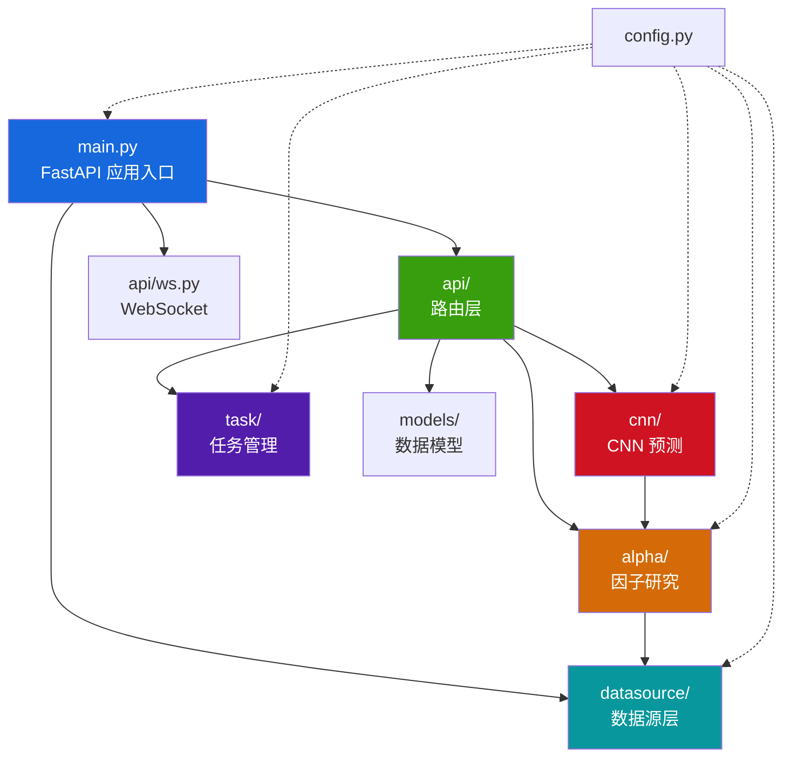

# AITrade 后端模块设计

> 本文档详细描述后端 6 大核心模块的职责、内部结构和相互关系。

---

## 模块依赖关系



---

## 一、datasource — 数据源抽象层

**路径**: `aitrade/datasource/`

### 职责
提供统一的多数据源接口，支持优先级降级和 TTL 缓存。屏蔽底层数据源差异，对上层提供一致的数据获取能力。

### 文件结构

| 文件 | 行数 | 职责 |
|------|------|------|
| `types.py` | 121 | 统一数据类型定义 (BarRecord, TickRecord, ContractInfo 等) |
| `base.py` | 152 | 抽象基类 BaseProvider，定义所有 Provider 必须实现的接口 |
| `manager.py` | 309 | DataSourceManager — 多 Provider 编排、优先级降级、TTL 缓存 |
| `tushare_provider.py` | ~17K | Tushare 数据源实现，连接 Tushare API 获取 A 股数据 |
| `mock_provider.py` | ~8.5K | Mock 数据源，用于无 Tushare Token 时的降级 |

### 核心设计

**Provider 模式**：
```python
class BaseProvider(ABC):
    def get_bar_history(symbol, exchange, interval, start, end) -> list[BarRecord] | None
    def get_tick_history(symbol, exchange, start, end) -> list[TickRecord] | None
    def get_contracts(product_type, exchange) -> list[ContractInfo] | None
    def get_trade_calendar(exchange, start, end) -> list[CalendarDay] | None
    def get_fundamental(symbol, exchange, start, end) -> list[FundamentalRecord] | None
    def get_adj_factor(symbol, exchange, start, end) -> list[dict] | None
```

**降级链**：
```
TushareProvider (priority=0) → MockProvider (priority=100)
```

**数据类别 (DataCategory)**：
- `CONTRACT` — 合约信息
- `BAR_HISTORY` — 历史 K 线
- `TICK_HISTORY` — 历史 Tick
- `TICK_REALTIME` — 实时行情
- `TRADE_CALENDAR` — 交易日历
- `FUNDAMENTAL` — 基本面数据
- `REFERENCE` — 复权因子

**TTL 缓存**：合约 300s, 日历 3600s, 基本面 600s, 复权因子 3600s

### 全局单例
```python
datasource_manager = DataSourceManager()  # 全局唯一实例
```

---

## 二、alpha — 因子研究模块

**路径**: `aitrade/alpha/`

### 职责
提供完整的 Alpha 因子研究工作流：数据加载 → 因子计算 → 数据预处理 → 模型训练 → 信号生成 → 策略回测。从 vnpy/alpha 项目独立抽取。

### 文件结构

| 文件/目录 | 行数 | 职责 |
|----------|------|------|
| `lab.py` | ~59K | **AlphaLab** — 核心管理器，负责数据读写、数据集/模型/信号的 CRUD |
| `logger.py` | 334 | 日志工具 |

### 子模块

#### dataset/ — 数据集与特征引擎

| 文件 | 职责 |
|------|------|
| `template.py` | AlphaDataset 模板类，管理特征表达式、标签、数据周期 |
| `ts_function.py` | 时序函数库 (ts_delay, ts_corr, ts_rank, ts_mean 等) |
| `cs_function.py` | 截面函数库 (cs_rank 等) |
| `math_function.py` | 数学运算库 (log, sign, abs, power 等) |
| `ta_function.py` | 技术指标函数 (MACD, RSI, ATR 等) |
| `processor.py` | 数据预处理 (Robust ZScore 标准化、缺失值填充) |
| `utility.py` | 辅助工具 (表达式解析器、Polars/Python 混合计算) |
| `datasets/alpha_101.py` | Alpha101 因子库实现 (~100 个因子) |
| `datasets/alpha_158.py` | Alpha158 因子库实现 (~50 个因子) |

#### model/ — 机器学习模型

| 文件 | 职责 |
|------|------|
| `template.py` | AlphaModel 基类 (fit / predict 接口) |
| `models/lgb_model.py` | LightGBM 梯度提升模型 |
| `models/mlp_model.py` | PyTorch 多层感知机模型 |
| `models/lasso_model.py` | Lasso 线性回归模型 |

#### strategy/ — 策略回测

| 文件 | 职责 |
|------|------|
| `template.py` | 策略模板基类 |
| `backtesting.py` | 回测引擎 (~32K)，撮合/持仓/统计/风险指标计算 |
| `strategies/equity_demo_strategy.py` | 股票多头 Demo 策略 |

### AlphaLab 核心 API

```python
class AlphaLab:
    # 数据 I/O
    save_bar_data(bars)                         # 保存 K 线到 Parquet
    load_bar_df(vt_symbols, interval, start, end) -> pl.DataFrame
    load_or_aggregate_bar_frame(...)             # 加载或聚合 bar 数据
    aggregate_market_data(...)                   # 周期聚合 (1m→5m 等)

    # 数据集
    save_dataset(name, dataset) / load_dataset(name)
    list_all_datasets() / remove_dataset(name)

    # 模型
    save_model(name, model) / load_model(name)
    list_all_models() / remove_model(name)

    # 信号
    save_signal(name, signal_df) / load_signal(name)
    list_all_signals() / remove_signal(name)

    # CSV 导入
    preview_csv(contents, mapping, data_kind)
    import_csv(csv_content, data_kind, interval, import_mode, mapping)

    # 资源管理
    list_data_resources() / get_data_resource_detail(kind, key)
    delete_data_resource(kind, key)
```

---

## 三、cnn — CNN 深度学习预测模块

**路径**: `aitrade/cnn/`

### 职责
基于多尺度卷积神经网络，对金融时序数据进行涨跌预测。支持多资产语义分组观测（目标/大盘/板块/龙头/自定义），多周期输入，多种标签模式。

### 文件结构

| 文件 | 行数 | 职责 |
|------|------|------|
| `model.py` | 487 | 特征工程 + 数据集构建 + 网络架构定义 |
| `trainer.py` | 297 | 训练流程 (归一化、训练循环、Early Stop) |
| `storage.py` | 122 | 模型 CRUD (保存/列表/详情/删除) |

### 核心设计

**数据张量维度**: `[N, C, T, S, G]`
- N = 样本数
- C = 6 个特征通道 (pct_change, volume_ratio, amplitude, ma5_diff, ma20_diff, high_low_ratio)
- T = 回看窗口长度 (lookback, 默认 30)
- S = 组内最大证券数
- G = 分组数

**网络架构 (GroupAwareMarketCNN)**：
```
输入 [N, C, T, S, G]
  → 按 G 维度展平为 [N*G, C, T, S]
  → 三路多尺度 Conv2d: kernel=(1,K) / (3,K) / (5,K)  → concat → [N*G, 48, T, S]
  → Masked pooling (按 group_mask 聚合 S 维度)
  → Conv1d 时序卷积 + AdaptiveAvgPool1d(8)
  → reshape 回 [N, G, 32, 8]
  → Flatten + Linear + Sigmoid → 涨跌概率
```

**标签模式 (LabelSpec)**：
| 模式 | 说明 |
|------|------|
| `next_bar` | 下一根 bar 涨跌 |
| `horizon_bars` | 未来 N 根 bar 涨跌 |
| `session_close` | 当日收盘价涨跌 (仅日内) |
| `next_session_close` | 次日收盘价涨跌 |

**训练特性**：
- 优化器: AdamW (weight_decay=1e-4)
- 学习率调度: CosineAnnealing
- 梯度裁剪: max_norm=1.0
- 早停: patience = max(10, epochs//5)
- 损失函数: BCELoss

---

## 四、task — 异步任务管理

**路径**: `aitrade/task/`

### 职责
管理所有长时间运行的后台任务（数据下载、模型训练、回测等）。提供线程安全的任务创建、状态更新和生命周期管理。

### 文件结构

| 文件 | 行数 | 职责 |
|------|------|------|
| `manager.py` | 175 | TaskManager 单例 — 线程池 + 任务状态管理 |

### 核心设计

```python
class TaskManager:                          # 线程安全单例
    create_task(type, params) -> task_id    # 创建任务
    run_async(task_id, func, ...)           # 提交到线程池
    update_task(task_id, **kwargs)          # 更新状态
    get_task(task_id) -> TaskModel          # 查询状态
    get_all_tasks() -> list[TaskModel]      # 全量查询
```

**任务类型 (TaskType)**：

| 类型 | 说明 |
|------|------|
| `DATA_DOWNLOAD` | 从 Tushare 下载原始数据 |
| `DATA_IMPORT` | CSV 文件导入 |
| `DATA_AGGREGATE` | 周期聚合 (1m→5m 等) |
| `DATASET_CREATE` | 创建因子数据集 |
| `MODEL_TRAIN` | Alpha 模型训练 |
| `SIGNAL_GENERATE` | 信号生成 |
| `BACKTEST_RUN` | 策略回测 |
| `CNN_TRAIN` | CNN 模型训练 |

**任务生命周期**：
```
PENDING → RUNNING → COMPLETED / FAILED
```

**清理策略**：
- 已完成/失败任务保留 24 小时
- 最多保留 200 个终态任务

**进度回调机制**：
```python
def on_progress(progress: float, message: str):
    """0-100 进度百分比 + 描述文字，自动更新到 TaskModel"""
```

---

## 五、models — Pydantic 数据模型

**路径**: `aitrade/models/`

### 职责
定义所有 API 请求/响应的 Pydantic 模型，确保类型安全和自动验证。

### 文件结构

| 文件 | 行数 | 职责 |
|------|------|------|
| `alpha.py` | 218 | 全部请求/响应模型定义 |

### 模型分类

**任务模型**：`TaskModel`, `TaskStatus`, `TaskType`

**Alpha 请求模型**：
| 模型 | 用途 |
|------|------|
| `DataDownloadRequest` | 原始数据下载 |
| `DataAggregateRequest` | 周期聚合 |
| `DatasetCreateRequest` | 数据集创建 |
| `ModelTrainRequest` | Alpha 模型训练 |
| `SignalGenerateRequest` | 信号生成 |
| `BacktestRunRequest` | 策略回测 |

**CNN 请求模型**：
| 模型 | 用途 |
|------|------|
| `CNNTrainRequest` | CNN 训练请求 (含所有超参) |
| `ObservationGroup` | 语义观测分组 |
| `ObservationRole` | 分组角色枚举 (target/market/sector/leaders/custom) |
| `LabelSpec` | 标签定义 |
| `LabelMode` | 标签模式枚举 |

**响应模型**：`DatasetInfo`, `ModelInfo`, `SignalInfo`, `SystemStatus`, `BarDataInfo`, `ContractSetting`

---

## 六、api — REST API 路由层

**路径**: `aitrade/api/`

### 职责
接收 HTTP 请求，参数校验，调用业务模块执行，返回标准化响应。所有长时间操作委托给 TaskManager 异步执行。

### 文件结构

| 文件 | 行数 | 路由前缀 | 职责 |
|------|------|---------|------|
| `alpha.py` | 1340 | `/api/alpha` | Alpha 研究全流程 API (数据/数据集/模型/信号/回测/资源/CSV) |
| `cnn.py` | 160 | `/api/cnn` | CNN 训练 + 模型管理 API |
| `status.py` | 53 | `/api` | 系统状态检查 |
| `ws.py` | 116 | `/ws` | WebSocket 连接管理 + 主题订阅 |

### WebSocket 主题

| 主题 | 用途 |
|------|------|
| `tick` | 实时行情推送 |
| `order` / `trade` | 订单/成交推送 |
| `position` / `account` | 持仓/账户推送 |
| `contract` | 合约信息 |
| `log` | 系统日志 |
| `task` | 任务状态变更 |

---

## 七、config — 全局配置

**路径**: `aitrade/config.py`

| 配置项 | 类型 | 说明 |
|--------|------|------|
| `AITRADE_HOME` | Path | `./.aitrade/` |
| `ALPHA_LAB_PATH` | Path | `./.aitrade/alpha_lab/` |
| `CNN_MODEL_PATH` | Path | `./.aitrade/cnn_models/` |
| `TASK_DB_PATH` | Path | `./.aitrade/tasks.db` |
| `API_HOST` / `API_PORT` | str/int | 服务地址 |
| `API_CORS_ORIGINS` | list | CORS 配置 (默认 `["*"]`) |
| `TUSHARE_TOKEN` | str | Tushare API Token |
| `MAX_WORKERS` | int | 并行工作线程数 |
| `CSV_FIELD_MAPPING` | dict | CSV 导入字段映射规则 |
