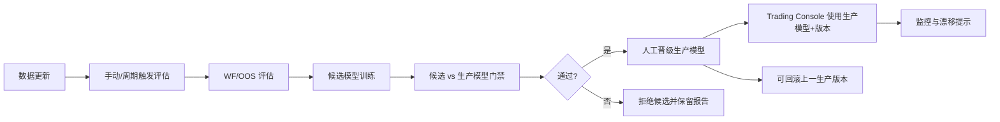

# CNN 模型滚动评估与半自动晋级

> 本文档是 CNN 模型治理模块的活文档（living doc）。目标是把“模型是否应该随着新数据更新”落成可审计、可回测、可回滚的工程闭环，而不是把新数据直接喂给生产模型做无门禁优化。
>
> 状态：v0.1 已实现基础闭环（治理存储/API、WF/OOS 评估、候选训练、晋级/拒绝/回滚、治理回放回测、前端 CNN 治理页）。

## 一、模块意义

量化模型面对市场 regime 漂移会衰减，因此需要定期再评估；但“总是用新数据优化模型”会放大短期噪声、过拟合和未来函数风险。CNN 治理模块解决的是：

- 什么时候应该更新模型；
- 候选模型是否真的优于当前生产模型；
- 模型更新机制在历史上是否有效；
- 换错模型后是否能审计和回滚。

核心原则：

- 不做在线增量学习；
- 不自动覆盖旧 checkpoint；
- 不自动上线；
- 候选模型先过 WF/OOS 与成本压测，再人工晋级；
- 治理机制本身必须能通过 Governance Replay 在历史上验证。

## 二、生命周期



## 三、术语与指标

| 缩写/术语 | 含义 | 用途 |
|---|---|---|
| WF | Walk-forward，滚动样本外验证 | 用多个历史窗口模拟未来使用过程 |
| OOS | Out-of-sample，样本外 | 训练期之后的验证/交易区间 |
| IC | 信息系数，预测收益与真实收益相关性 | 回归模型核心指标 |
| RankIC | 排序信息系数 | 判断预测排序是否有效 |
| AUC | 分类排序能力 | 分类模型核心指标 |
| Excess Acc | 超额准确率，准确率减多数类基线 | 判断方向预测是否超过“永远猜多数类” |
| SR | Sharpe Ratio | 风险调整后收益 |
| MDD | Maximum Drawdown，最大回撤 | 风险指标 |
| PnL | Profit and Loss | 盈亏 |
| Turnover | 换手率/成交金额 | 衡量交易成本敏感性 |
| Governance Replay | 治理回放回测 | 验证模型更新机制本身是否有效 |
| Promotion | 候选模型晋级生产模型 | 只更新治理别名，不覆盖模型文件 |
| Rollback | 回滚生产模型 | 恢复上一生产模型版本 |
| PSI | Population Stability Index | 后续用于信号/特征漂移监控 |
| KS | Kolmogorov-Smirnov 统计量 | 后续用于分布漂移监控 |

## 四、后端契约

存储目录：

```text
${AITRADE_HOME}/cnn_governance/
├── config.json
├── production.json
├── candidates/
├── reports/
├── replay_reports/
├── history.jsonl
└── scheduler_state.json
```

API：

| 方法 | 路径 | 说明 |
|---|---|---|
| GET | `/api/cnn/governance/config` | 读取治理配置 |
| PUT | `/api/cnn/governance/config` | 更新治理配置 |
| GET | `/api/cnn/governance/production` | 读取当前生产模型 |
| GET | `/api/cnn/governance/candidates` | 候选模型列表 |
| GET | `/api/cnn/governance/candidates/{candidate_id}` | 候选详情 |
| POST | `/api/cnn/governance/evaluate` | 启动 WF/OOS 评估任务 |
| POST | `/api/cnn/governance/candidates/train` | 启动候选训练任务 |
| POST | `/api/cnn/governance/candidates/{candidate_id}/promote` | 人工晋级候选 |
| POST | `/api/cnn/governance/candidates/{candidate_id}/reject` | 人工拒绝候选 |
| POST | `/api/cnn/governance/rollback` | 回滚生产模型 |
| GET | `/api/cnn/governance/history` | 治理历史 |
| GET | `/api/cnn/governance/reports/{report_id}` | WF/OOS 报告 |
| POST | `/api/cnn/governance/replay/run` | 启动治理回放回测 |
| GET | `/api/cnn/governance/replay` | 治理回放报告列表 |
| GET | `/api/cnn/governance/replay/{replay_id}` | 治理回放报告详情 |

## 五、门禁规则

默认门禁采用“相对胜出现有生产模型”：

- 候选在多数 WF 折中核心分数优于生产模型；
- 平均核心分数提升不低于 `min_core_score_delta`；
- 若启用 `require_positive_oos`，候选平均 OOS 核心分数必须为正；
- 无生产模型时只生成报告，不自动上线，允许人工设置首个生产模型。

核心分数第一版为工程启发式：总收益、Sharpe、最大回撤、无成交惩罚综合得到。后续可替换为更严格的目标函数。

## 六、治理回放回测

普通回测验证“某个模型是否赚钱”；治理回放验证“模型更新机制是否有效”。

回放对照组：

| 对照组 | 说明 |
|---|---|
| fixed_initial_model | 固定初始模型，不更新 |
| always_retrain | 每周期无脑重训并替换 |
| governed_promotion | 只有候选胜出时才切换模型 |
| buy_and_hold | 买入持有目标标的 |

回放过程必须模拟真实时间：

1. 训练初始模型；
2. 按评估周期滚动；
3. 每周期只使用周期开始日前的数据训练候选；
4. 在下一个交易周期回测当前生产模型；
5. 同步计算固定模型、无脑重训、治理晋级和买入持有；
6. 输出收益、Sharpe、最大回撤、成交次数、成本、晋级/拒绝事件；
7. 若治理组未优于固定模型与无脑重训，则不建议启用生产晋级。

## 七、前端功能

新增 `/cnn-governance` 页面：

- 当前生产模型卡片；
- 治理配置；
- WF/OOS 评估表单；
- 候选训练表单；
- 候选列表、报告、晋级、拒绝；
- 回滚生产模型；
- 治理回放回测表单；
- 四组回放结果对比；
- 治理历史。

回测页面新增“治理回放回测”入口，跳转到 CNN 治理页。

Trading Console 默认读取治理层生产模型，并自动填入 `model_version`，保证 `signal_id` 可追溯。

## 八、阶段路线图

| Phase | 名称 | 状态 | 验收 |
|---|---|---|---|
| 0 | 文档与契约冻结 | ✅ 完成 | 本文档覆盖 Phase 0-10、术语、API、回放设计 |
| 1 | 治理存储与基础 API | ✅ 完成 | config/production/candidates/reports/history 可读写 |
| 2 | WF 评估引擎 | ✅ 完成 | 可生成 WF/OOS 报告 |
| 3 | 候选模型训练 | ✅ 完成 | 候选模型、候选记录、报告关联 |
| 4 | 相对胜出门禁与成本压测 | 🟡 部分完成 | 已有相对胜出门禁；成本压测后续扩展为多场景 |
| 5 | 晋级、拒绝、回滚 | ✅ 完成 | 生产模型别名可切换并记录历史 |
| 6 | 治理回放回测后端 | ✅ 完成 | 固定模型/无脑重训/治理晋级/买入持有四组报告 |
| 7 | 治理回放回测前端 | ✅ 完成 | 可启动回放并查看对比摘要 |
| 8 | 周期配置与手动触发 | 🟡 部分完成 | 可配置周期并手动触发；真实后台调度后续补 |
| 9 | 监控与漂移提示 | 🟡 预留 | 配置与文档预留 PSI/KS；生产健康摘要后续增强 |
| 10 | Alpha 扩展预留 | ✅ 文档完成 | 本文档记录扩展方向，代码不引入半成品 Alpha 治理 |

## 九、Alpha 扩展预留

Alpha 模型未来可复用同一治理框架：

- 将 Alpha 训练任务封装为候选训练器；
- 将 Alpha 信号生成 + 回测封装为 OOS evaluator；
- 使用同一 production/candidate/report/history 存储；
- 前端可在 CNNGovernance 抽象后升级为 ModelGovernance。

第一版不实现 Alpha 治理，避免把 CNN 实盘路径之外的功能做成半成品。

