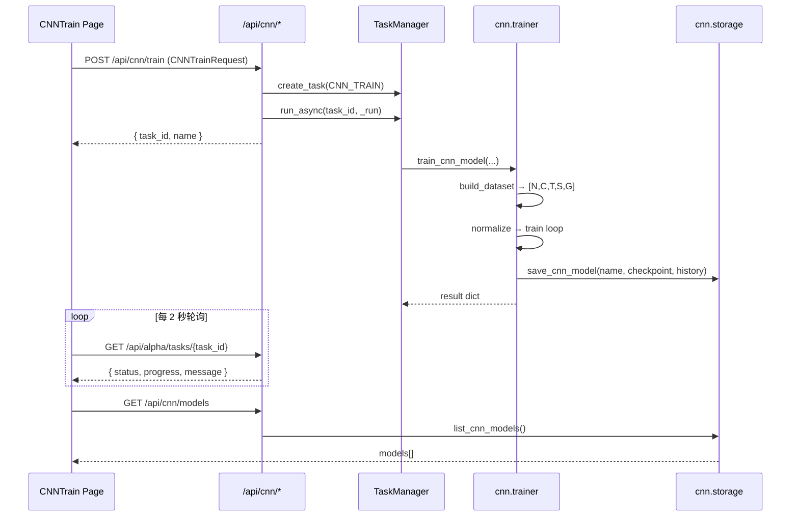
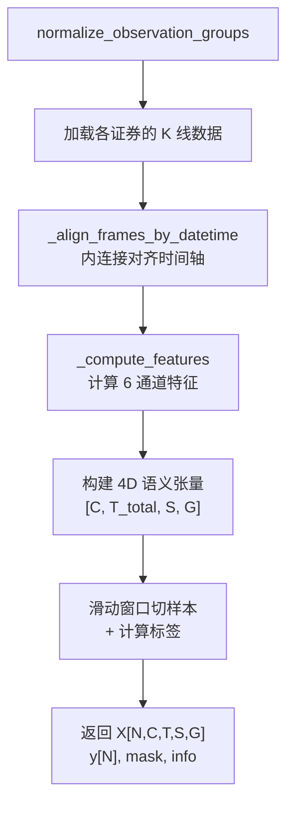
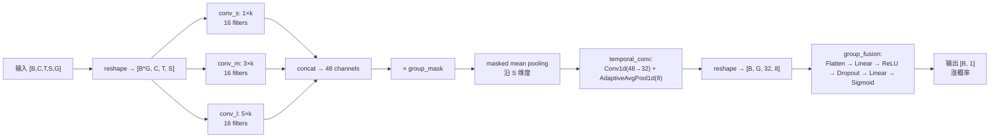
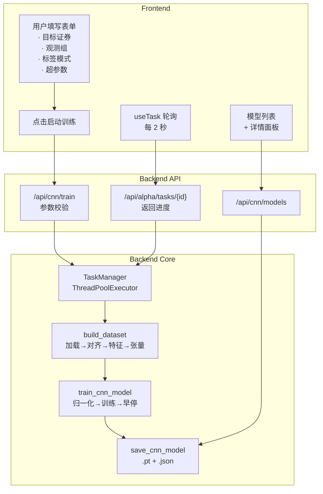

# CNN 模块前后端代码深度阅读

## 一、模块总览与架构

CNN 模块是 AITrade 量化研究平台中用于训练多尺度卷积神经网络的子系统。它完成了从"原始 K 线/Tick → 特征张量 → 模型训练 → 模型持久化 → 前端可视化"的完整闭环。

### 文件地图

```
后端 backend/aitrade/
├── cnn/
│   ├── __init__.py          # 包导出
│   ├── model.py             # ★ 核心：特征工程 + 张量构建 + PyTorch 模型定义
│   ├── trainer.py           # ★ 核心：训练流程（归一化、训练循环、早停）
│   └── storage.py           # 模型持久化（保存/列表/详情/删除）
├── api/cnn.py               # FastAPI 路由层（HTTP 接口）
├── models/alpha.py          # Pydantic 请求/响应 Schema
└── task/manager.py          # 通用异步任务管理器

前端 frontend/src/
├── types/cnn.ts             # TypeScript 类型定义
├── api/cnn.ts               # Axios API 客户端封装
├── pages/CNNTrain/index.tsx  # ★ CNN 训练页面（表单 + 模型列表 + 详情查看）
├── hooks/useTask.ts          # 任务状态轮询 Hook
└── components/TaskStatusPanel.tsx  # 任务进度展示组件
```

### 前后端交互架构



---

## 二、后端代码详解

### 2.1 数据模型层 — Pydantic Schema

**文件**: [alpha.py](file:///Users/kevin_1/aitrade/backend/aitrade/models/alpha.py#L115-L160)

这是 CNN 训练请求的入口类型定义：

```python
class CNNTrainRequest(BaseModel):
    name: str                          # 模型名称
    start: date                        # 训练数据开始日期
    end: date                          # 训练数据结束日期
    vt_symbols: list[str] = []         # 兼容旧接口的证券列表
    target_symbol: Optional[str]       # 预测目标证券
    input_data_kind: str = "bar"       # 输入类型: bar | tick
    input_interval: str = "d"          # 输入周期: d/1m/5m/...
    label_spec: LabelSpec              # 标签定义
    observation_groups: list[ObservationGroup]  # 语义观测分组
    # 训练超参数
    epochs: int = 50
    batch_size: int = 32
    learning_rate: float = 0.001
    lookback: int = 30                 # 回看窗口（构建样本的时间步数）
    dropout: float = 0.5
    train_ratio: float = 0.7
```

**语义观测分组 `ObservationGroup`** 是 CNN 模块最核心的设计理念：

```python
class ObservationRole(str, Enum):
    TARGET = "target"     # 目标证券（自动注入，用户不手动添加）
    MARKET = "market"     # 大盘指数
    SECTOR = "sector"     # 板块指数
    LEADERS = "leaders"   # 龙头股
    CUSTOM = "custom"     # 自定义

class ObservationGroup(BaseModel):
    role: ObservationRole
    name: str              # 分组展示名称，如 "银行板块"
    symbols: list[str]     # 该组内的证券列表
```

**标签模式 `LabelSpec`** 定义了模型要预测什么：

```python
class LabelMode(str, Enum):
    NEXT_BAR = "next_bar"                   # 下一根 bar 涨跌
    HORIZON_BARS = "horizon_bars"           # N 根 bar 后涨跌
    SESSION_CLOSE = "session_close"         # 当日收盘涨跌（仅日内周期）
    NEXT_SESSION_CLOSE = "next_session_close"  # 次日收盘涨跌

class LabelSpec(BaseModel):
    mode: LabelMode = LabelMode.NEXT_BAR
    horizon: Optional[int] = None  # 仅 horizon_bars 模式需要
```

> [!IMPORTANT]
> `LabelSpec` 的 `mode` 决定了样本标签的生成策略。`session_close` 和 `next_session_close` 需要根据交易日历来定位"当日最后一根 bar"或"次日最后一根 bar"，逻辑较复杂。

---

### 2.2 CNN 核心 — model.py

**文件**: [model.py](file:///Users/kevin_1/aitrade/backend/aitrade/cnn/model.py)

这是整个 CNN 模块最核心的文件，包含 3 大功能：特征工程、数据集构建、模型定义。

#### 2.2.1 特征工程：6 个技术指标通道

[_compute_features](file:///Users/kevin_1/aitrade/backend/aitrade/cnn/model.py#L170-L193) 为每个证券计算 6 个特征通道：

| 通道 | 名称 | 计算公式 | 含义 |
|------|------|----------|------|
| 0 | `pct_change` | `(close[t] - close[t-1]) / close[t-1]` | 价格变动率 |
| 1 | `volume_ratio` | `volume[t] / mean(volume[t-5:t])` | 量比（5 日均量比） |
| 2 | `amplitude` | `(high[t] - low[t]) / close[t-1]` | 振幅 |
| 3 | `ma5_diff` | `close[t] / MA5 - 1` | 与 5 日均线偏离度 |
| 4 | `ma20_diff` | `close[t] / MA20 - 1` | 与 20 日均线偏离度 |
| 5 | `high_low_ratio` | `(high - low) / close` | 当根 bar 的高低比 |

> [!NOTE]
> 注意特征计算中的边界处理：`pct_change` 和 `amplitude` 的第 0 个时间步为 0（无前一天数据），`volume_ratio` 前 5 个为 0，`ma20_diff` 前 20 个为 0。这些"冷启动"值会被 lookback 窗口吸收，不影响训练样本。

#### 2.2.2 观测组规范化

[normalize_observation_groups](file:///Users/kevin_1/aitrade/backend/aitrade/cnn/model.py#L44-L104) 的核心逻辑：

1. **强制注入 target 组**：`target_symbol` 始终作为第 1 个分组（role=target）
2. **过滤用户添加的 target 组**：如果用户在 `observation_groups` 里也传了 `target`，则跳过
3. **兼容旧接口**：如果没传 `observation_groups` 但传了 `vt_symbols`，将 `vt_symbols[1:]` 封装为 `custom` 组
4. **去重**：每组内通过 `dict.fromkeys()` 去除重复 symbol

```
示例输入:
  target_symbol = "000001.SZSE"
  observation_groups = [
    { role: "market", name: "大盘", symbols: ["399300.SZSE"] },
    { role: "sector", name: "银行", symbols: ["601398.SSE", "601288.SSE"] }
  ]

输出 groups:
  [0] { role: "target",  name: "目标证券", symbols: ["000001.SZSE"] }
  [1] { role: "market",  name: "大盘",     symbols: ["399300.SZSE"] }
  [2] { role: "sector",  name: "银行",     symbols: ["601398.SSE", "601288.SSE"] }

→ group_count = 3, max_group_width = 2
```

#### 2.2.3 数据集构建：build_dataset

[build_dataset](file:///Users/kevin_1/aitrade/backend/aitrade/cnn/model.py#L244-L398) 是构建训练数据的核心函数。

**完整流程图**：



**关键步骤详解**：

**步骤 1 — 加载与对齐**（L282-L319）：
- 逐个加载每个证券的 K 线数据（通过 `AlphaLab` 模块）
- 所有证券按 `datetime` 列做 **inner join**，确保只保留公共交易时段
- 任何一个证券数据缺失会直接报错（不使用 mock 数据）

**步骤 2 — 构建 4D 张量**（L327-L337）：

```python
aligned = np.zeros((C, T_total, S, G), dtype=np.float32)
# C = 6 (特征通道)
# T_total = 公共时间步数
# S = max_group_width (最大组内证券数)
# G = group_count (分组数)

# 填充：
for group_index, group in enumerate(groups):
    for symbol_index, symbol in enumerate(group["symbols"]):
        aligned[:, :, symbol_index, group_index] = features[symbol].T
```

**步骤 3 — 滑动窗口 + 标签生成**（L348-L377）：

```python
for anchor in range(lookback - 1, total_steps):
    # 1. 计算未来索引（由 label_spec 决定）
    future_index = _label_future_index(anchor, datetimes, label_spec)
    
    # 2. 切出 lookback 窗口的快照
    snapshot = aligned[:, anchor - lookback + 1 : anchor + 1, :, :]  # [C, T, S, G]
    
    # 3. 计算二分类标签
    future_return = (future_close - base_close) / base_close
    label = 1.0 if future_return > 0 else 0.0
```

**最终输出张量形状**：
- `X`: `[N, C, T, S, G]` = `[样本数, 6, lookback, 最大组宽, 组数]`
- `y`: `[N]` — 二分类标签（涨=1, 跌=0）
- `mask`: `[1, 1, 1, S, G]` — 有效位置掩码（处理组内证券数不等的情况）

> [!TIP]
> `group_mask` 的作用：假设 target 组只有 1 只股票，而 sector 组有 3 只，那么 `max_group_width = 3`。target 组的 `mask[:,:,:,1:3, 0]` 为 0，表示后两个位置是 padding，不参与计算。

#### 2.2.4 标签生成策略

[_label_future_index](file:///Users/kevin_1/aitrade/backend/aitrade/cnn/model.py#L207-L241) 的四种模式：

| 模式 | 逻辑 | 适用场景 |
|------|------|----------|
| `next_bar` | `anchor + 1` | 最简单，预测下一根 bar 涨跌 |
| `horizon_bars` | `anchor + horizon` | 预测 N 根 bar 后的涨跌 |
| `session_close` | 当日最后一根 bar 的索引 | 日内策略，预测当日收盘方向 |
| `next_session_close` | 次日最后一根 bar 的索引 | 预测次日整体走势 |

`session_close` 和 `next_session_close` 通过 [_build_session_last_index](file:///Users/kevin_1/aitrade/backend/aitrade/cnn/model.py#L196-L204) 构建 `day → last_index` 映射来定位。

#### 2.2.5 PyTorch 模型：GroupAwareMarketCNN

[create_market_cnn](file:///Users/kevin_1/aitrade/backend/aitrade/cnn/model.py#L401-L475) 定义了一个多尺度卷积网络。

**模型结构图**：



**关键设计细节**：

1. **多尺度卷积**：三个并行卷积分支使用不同的时间核大小（1/3/5），各生成 16 个 filter，拼接后得到 48 通道。这类似 Inception 的思想，同时捕获短/中/长期模式。

2. **Group 维度处理**：输入先按 G 维度展开为 `[B*G, C, T, S]`，每个分组独立做卷积。这样 target 组和 market 组各自提取自己的特征。

3. **Masked Mean Pooling**（L468-L470）：
   ```python
   masked = features * mask        # 把 padding 位置清零
   denom = mask.sum(dim=3).clamp_min(1.0)  # 有效位置数
   pooled = masked.sum(dim=3) / denom      # 求均值而非求和
   ```
   这确保了组内证券数不等时的公平性。

4. **Temporal Conv**（L438-L443）：`Conv1d(48→32)` + `AdaptiveAvgPool1d(8)` 将时间维度压缩到固定 8 步。

5. **Group Fusion**（L446-L453）：将所有分组的特征 flatten 后，经过 MLP 输出单个涨跌概率。`fusion_hidden = max(96, 32*G)` 确保隐藏层宽度随分组数自适应。

---

### 2.3 训练流程 — trainer.py

**文件**: [trainer.py](file:///Users/kevin_1/aitrade/backend/aitrade/cnn/trainer.py)

#### 2.3.1 归一化

[_normalize_grouped_tensor](file:///Users/kevin_1/aitrade/backend/aitrade/cnn/trainer.py#L28-L52) 对张量做 **channel-wise z-score 归一化**：

- 仅在 **训练集** 上拟合 `mean` 和 `std`
- 然后同时应用到训练集和验证集
- 归一化统计量保存在 checkpoint 中（推理时需要复用）
- 使用 `group_mask` 确保 padding 位置不参与统计

```python
channel_mean = (train_x * mask).sum(axis=(0,2,3,4)) / valid_count
channel_std = sqrt(((train_x - mean)^2 * mask).sum(...) / count) + 1e-8
normalized = (full_x - mean) / std * mask
```

#### 2.3.2 训练循环

[train_cnn_model](file:///Users/kevin_1/aitrade/backend/aitrade/cnn/trainer.py#L55-L297) 的完整流程：

```
1. 构建数据集 (build_dataset)
2. 按 train_ratio 时序切分（前 70% 训练，后 30% 验证）
3. 归一化
4. 创建 DataLoader
5. 创建模型 + 优化器(AdamW + CosineAnnealing) + 损失函数(BCELoss)
6. 训练循环:
   - 每 epoch: train → eval → 记录 history
   - Early Stopping: patience = max(10, epochs//5)
   - 梯度裁剪: clip_grad_norm_(1.0)
7. 加载最佳权重 → 保存 checkpoint
```

**训练配置细节**：

| 配置项 | 值 | 说明 |
|--------|-----|------|
| 优化器 | AdamW | weight_decay=1e-4 |
| 学习率调度 | CosineAnnealingLR | T_max=epochs |
| 损失函数 | BCELoss | 二分类交叉熵 |
| 梯度裁剪 | 1.0 | 防止梯度爆炸 |
| 早停 | patience = max(10, epochs//5) | 容忍改善阈值 0.0001 |
| 随机种子 | 42 | 可复现 |

> [!NOTE]
> 数据是按时间顺序切分的（前 70% 训练，后 30% 验证），**不是随机打乱**。这是金融时序建模的正确做法，避免未来信息泄漏。但训练集的 DataLoader 使用了 `shuffle=True`，这是在训练集内部打乱 mini-batch 顺序，不影响数据泄漏问题。

#### 2.3.3 Checkpoint 保存内容

```python
save_data = {
    "model_state_dict": model.state_dict(),     # 模型权重
    "model_config": { C, T, S, G, dropout },    # 重建模型的参数
    "train_config": { symbols, target, groups, dates, hyperparams... },
    "normalization": { channel_mean, channel_std, group_mask },  # 推理时需要
    "dataset_info": { feature_names, anchor_dates, skipped_for_label },
    "best_epoch": best_epoch,
    "best_val_loss": best_val_loss,
}
```

---

### 2.4 模型持久化 — storage.py

**文件**: [storage.py](file:///Users/kevin_1/aitrade/backend/aitrade/cnn/storage.py)

提供 4 个功能：

| 函数 | 说明 |
|------|------|
| [save_cnn_model](file:///Users/kevin_1/aitrade/backend/aitrade/cnn/storage.py#L22-L43) | `torch.save()` 保存 `.pt` + JSON 历史 |
| [list_cnn_models](file:///Users/kevin_1/aitrade/backend/aitrade/cnn/storage.py#L46-L80) | 遍历 `*.pt` 文件，加载 checkpoint 提取摘要 |
| [get_cnn_model_detail](file:///Users/kevin_1/aitrade/backend/aitrade/cnn/storage.py#L83-L108) | 加载完整 checkpoint + 训练历史 |
| [delete_cnn_model](file:///Users/kevin_1/aitrade/backend/aitrade/cnn/storage.py#L111-L122) | 删除 `.pt` 和 `_history.json` 文件 |

> [!WARNING]
> `list_cnn_models` 每次调用都会 `torch.load()` 所有模型文件来提取元数据。如果模型文件很大（几十 MB），这个列表操作会比较慢。

---

### 2.5 API 路由层 — api/cnn.py

**文件**: [cnn.py](file:///Users/kevin_1/aitrade/backend/aitrade/api/cnn.py)

| 端点 | 方法 | 功能 |
|------|------|------|
| `/api/cnn/status` | GET | 检查 PyTorch 是否可用 + 返回设备（cuda/cpu） |
| `/api/cnn/train` | POST | 启动 CNN 训练任务（异步） |
| `/api/cnn/models` | GET | 列出所有已保存的 CNN 模型 |
| `/api/cnn/models/{name}` | GET | 获取模型详情（含完整训练历史） |
| `/api/cnn/models/{name}` | DELETE | 删除指定模型 |

**训练接口详解**（[start_cnn_train](file:///Users/kevin_1/aitrade/backend/aitrade/api/cnn.py#L58-L128)）：

```
1. 验证参数：
   - start < end
   - 0 < train_ratio < 1
   - input_data_kind ∈ {bar, tick}
   - input_interval ∈ {d, 1m, 5m, 10m, 15m, 30m, 60m}
   - tick + d 组合不允许
   - horizon_bars 必须提供 horizon

2. 合并证券列表：
   - 从 observation_groups 中提取所有 symbols
   - 与 vt_symbols 合并去重
   - 确保 target_symbol 在列表中

3. 创建异步任务：
   - task_manager.create_task(TaskType.CNN_TRAIN, ...)
   - task_manager.run_async(task_id, _run, enable_progress=True)
   - 立即返回 { task_id, name }
```

> [!NOTE]
> CNN 训练任务复用了项目的通用 [TaskManager](file:///Users/kevin_1/aitrade/backend/aitrade/task/manager.py)。`TaskManager` 是一个线程安全的单例，使用 `ThreadPoolExecutor` 在后台线程执行耗时操作，通过 `on_progress` 回调实时更新进度。前端通过 `/api/alpha/tasks/{task_id}` 端点轮询任务状态（注意：任务查询端点在 alpha 路由下，CNN 模块共用）。

---

## 三、前端代码详解

### 3.1 TypeScript 类型 — types/cnn.ts

**文件**: [cnn.ts](file:///Users/kevin_1/aitrade/frontend/src/types/cnn.ts)

```typescript
// 模型列表项
interface CNNModelInfo {
  name: string
  created_at: string
  size_mb?: number
  best_epoch?: number
  best_val_loss?: number
  target_symbol?: string
  input_data_kind?: string
  input_interval?: string
  group_count?: number
  observation_groups?: Array<Record<string, unknown>>
}

// 模型详情（扩展列表项）
interface CNNModelDetail extends CNNModelInfo {
  train_config: Record<string, unknown>
  model_config: Record<string, unknown>
  normalization?: Record<string, unknown>
  dataset_info?: Record<string, unknown>
  history: CNNHistoryItem[]   // 完整训练历史
}

// 训练历史中的单条记录
interface CNNHistoryItem {
  epoch: number
  train_loss: number
  val_loss: number
  train_acc: number
  val_acc: number
  lr?: number
}
```

> [!NOTE]
> `CNNTrainRequest`、`LabelSpec`、`ObservationGroup` 等类型从 `types/alpha.ts` 中重导出，说明前端类型和后端 Pydantic 模型中的 alpha 模块共享了部分类型定义。

### 3.2 API 客户端 — api/cnn.ts

**文件**: [cnn.ts](file:///Users/kevin_1/aitrade/frontend/src/api/cnn.ts)

```typescript
export const cnnService = {
  getStatus:   () => api.get<CNNStatus>('/api/cnn/status'),
  train:       (req) => api.post<TaskStartResponse>('/api/cnn/train', req),
  listModels:  () => api.get<CNNModelInfo[]>('/api/cnn/models'),
  getModel:    (name) => api.get<CNNModelDetail>(`/api/cnn/models/${name}`),
  deleteModel: (name) => api.delete(`/api/cnn/models/${name}`),
}
```

基于 Axios 实例 ([client.ts](file:///Users/kevin_1/aitrade/frontend/src/api/client.ts))，默认 baseURL 为 `http://localhost:8000`，超时 60 秒。

### 3.3 任务轮询机制 — useTask Hook

**文件**: [useTask.ts](file:///Users/kevin_1/aitrade/frontend/src/hooks/useTask.ts)

```typescript
export function useTask(taskId: string | null) {
  return useQuery<Task>({
    queryKey: ['task', taskId],
    queryFn: () => alphaService.getTask(taskId!),
    enabled: !!taskId,
    refetchInterval: (q) => {
      const task = q.state.data
      if (task?.status === 'completed' || task?.status === 'failed') return false
      return 2000  // 每 2 秒轮询一次
    },
  })
}
```

**行为**：
- `taskId` 为 null 时不发请求
- 任务运行中每 2 秒自动重新获取
- 任务完成或失败后停止轮询

### 3.4 任务状态面板 — TaskStatusPanel

**文件**: [TaskStatusPanel.tsx](file:///Users/kevin_1/aitrade/frontend/src/components/TaskStatusPanel.tsx)

展示任务的当前状态：
- 状态 Tag（pending/running/completed/failed，各有不同颜色）
- `<Progress>` 进度条
- 运行中显示 `task.message`（来自后端 `on_progress` 回调）
- 完成时以 `<Alert type="success">` 展示完整 `task.result` JSON
- 失败时以 `<Alert type="error">` 显示错误信息

### 3.5 CNN 训练页面 — CNNTrain/index.tsx ★

**文件**: [index.tsx](file:///Users/kevin_1/aitrade/frontend/src/pages/CNNTrain/index.tsx)

这是 CNN 模块最核心的前端组件，包含 **603 行** 代码。

#### 页面布局结构

```
┌─────────────────────────────────────────────────────────────┐
│  CNN 训练工作流 (Title)                                      │
│  先选输入源和周期，再配置目标证券与语义观测组... (描述)          │
├─────────────────────────────────────────────────────────────┤
│  [TaskStatusPanel] 当前训练任务进度                           │
├────────────────────────┬────────────────────────────────────┤
│  左栏 (xs=24 xl=10)   │  右栏 (xs=24 xl=14)                │
│                        │                                    │
│  ┌──────────────────┐  │  ┌──────────────────────────────┐  │
│  │ 步骤1·选择输入源  │  │  │ 已保存 CNN 模型              │  │
│  │ · 模型名称       │  │  │ [Table: 模型/目标/损失/操作]  │  │
│  │ · 输入数据类型   │  │  └──────────────────────────────┘  │
│  │ · 输入周期       │  │                                    │
│  │ · 时间范围       │  │  ┌──────────────────────────────┐  │
│  └──────────────────┘  │  │ 训练详情 · {model_name}       │  │
│                        │  │                                │  │
│  ┌──────────────────┐  │  │ [Descriptions]                │  │
│  │ 步骤2·目标与观测  │  │  │  目标证券 / 输入 / 标签 ...  │  │
│  │ · 目标证券       │  │  │                                │  │
│  │ ─────────────    │  │  │ [Card: 观测组配置]             │  │
│  │ · 分组角色       │  │  │  - 组名 / role / symbols      │  │
│  │ · 分组名称       │  │  │                                │  │
│  │ · 证券列表       │  │  │ [Card: 训练历史]               │  │
│  │ [添加观测组]     │  │  │  [LossTable]                  │  │
│  │ ─────────────    │  │  └──────────────────────────────┘  │
│  │ [观测组列表]     │  │                                    │
│  └──────────────────┘  │                                    │
│                        │                                    │
│  ┌──────────────────┐  │                                    │
│  │ 步骤3·标签定义    │  │                                    │
│  │ · 标签模式       │  │                                    │
│  │ · 预测跨度(可选) │  │                                    │
│  └──────────────────┘  │                                    │
│                        │                                    │
│  ┌──────────────────┐  │                                    │
│  │ 步骤4·训练参数    │  │                                    │
│  │ Epochs/Batch/LR  │  │                                    │
│  │ Lookback/Drop/TR │  │                                    │
│  │ [张量预估 Alert]  │  │                                    │
│  │ [启动 CNN 训练]   │  │                                    │
│  └──────────────────┘  │                                    │
└────────────────────────┴────────────────────────────────────┘
```

#### 核心状态管理

```typescript
// 两个 Antd Form 实例
const [form] = Form.useForm()          // 主表单（模型名称、参数、标签等）
const [groupForm] = Form.useForm()     // 观测组添加表单

// 本地 state
const [observationGroups, setObservationGroups] = useState<ObservationGroup[]>([])
const [taskId, setTaskId] = useState<string | null>(null)
const [viewDetail, setViewDetail] = useState<CNNModelDetail | null>(null)
const [submitting, setSubmitting] = useState(false)

// React Query
const task = useTask(taskId)                    // 任务轮询
const { data: resources } = useQuery(...)       // 获取可用数据源（周期列表等）
const { data: models, refetch } = useQuery(...) // 模型列表
```

#### 关键交互逻辑

**1. 添加观测组** ([addGroup](file:///Users/kevin_1/aitrade/frontend/src/pages/CNNTrain/index.tsx#L206-L224))：
- 从 `groupForm` 提取值
- 将证券文本按 `\n` 或 `,` 分割
- 禁止添加 `target` 角色的组
- 追加到 `observationGroups` state

**2. 启动训练** ([handleTrain](file:///Users/kevin_1/aitrade/frontend/src/pages/CNNTrain/index.tsx#L230-L266))：
- 验证表单 → 组装 `CNNTrainRequest` → 调用 `cnnService.train()`
- 获取返回的 `task_id` → 设置到 state → 触发 `useTask` 开始轮询
- 训练期间按钮显示 loading 状态

**3. 训练完成自动刷新** ([useEffect](file:///Users/kevin_1/aitrade/frontend/src/pages/CNNTrain/index.tsx#L189-L198))：
```typescript
useEffect(() => {
  if (task.data?.status === 'completed') {
    refetchModels()                    // 刷新模型列表
    cnnService.getModel(name)          // 自动加载训练详情
      .then(setViewDetail)
  }
}, [task.data?.status])
```

**4. 张量形状预估** ([tensorEstimate](file:///Users/kevin_1/aitrade/frontend/src/pages/CNNTrain/index.tsx#L142-L154))：
```typescript
const tensorEstimate = useMemo(() => ({
  channels: 6,                           // 固定 6 个特征通道
  time: lookback,                         // 来自表单
  width: Math.max(1, ...groups.map(g => g.symbols.length)),
  groups: observationGroups.length + 1,   // +1 是 target 组
}), [lookback, observationGroups])
```
实时在 Alert 中显示 `6 x 30 x 2 x 3` 这样的预估。

**5. 从其他页面跳转的预设值** ([preset](file:///Users/kevin_1/aitrade/frontend/src/pages/CNNTrain/index.tsx#L100-L108))：
```typescript
const preset = location.state?.preset
// 可能从数据准备页或资源管理页跳转过来，携带：
// { target_symbol, input_data_kind, input_interval, symbols }
```

#### LossTable 子组件

[LossTable](file:///Users/kevin_1/aitrade/frontend/src/pages/CNNTrain/index.tsx#L63-L79) — 展示训练历史的 Antd Table：

| 列 | 数据 | 格式化 |
|-----|------|--------|
| Epoch | `epoch` | 数字 |
| Train Loss | `train_loss` | 原始值 |
| Val Loss | `val_loss` | 原始值 |
| Train Acc | `train_acc` | `xx.x%` |
| Val Acc | `val_acc` | `xx.x%` |
| LR | `lr` | 原始值 |

---

## 四、完整数据流总结



### 一次完整训练的生命周期

1. **用户配置**（前端）：填写模型名、选择 target_symbol + 观测组 + 标签模式 + 超参数
2. **请求发送**（前端→后端）：`POST /api/cnn/train`，携带完整 `CNNTrainRequest`
3. **参数校验**（后端 API 层）：日期合理性、周期合法性、证券列表非空等
4. **创建异步任务**（TaskManager）：分配 `task_id`，立即返回给前端
5. **数据构建**（model.py）：
   - 加载 K 线 → 时间轴对齐 → 计算 6 通道特征 → 组装 5D 张量
   - 滑动窗口切样本 + 生成标签
6. **训练**（trainer.py）：
   - 时序切分训练/验证集 → 归一化 → DataLoader
   - AdamW + CosineAnnealing → 训练循环 → 早停
7. **保存**（storage.py）：`.pt` checkpoint + `_history.json`
8. **进度更新**（全程）：`on_progress(percent, message)` → TaskManager → 前端轮询
9. **结果展示**（前端）：自动刷新模型列表 + 加载训练详情面板

---

## 五、路径形态多分类（path_class）

> 特性来源：`.kiro/specs/cnn-path-multiclass-head/`，分支 `feat/cnn-path-multiclass-head`，Task 1~8 全部闭环。

### 5.1 是什么——四类出场剧本

`objective="path_class"` 将预测目标从"方向（涨/跌）"升级为"持仓路径"，对未来 `max_hold` 根 bar 内的出场方式做四分类：

| 标签 | 编码 | 含义 | 触发条件 |
|------|------|------|----------|
| `tp_first` | 0 | 止盈先触发 | 持仓期内收盘价首先触及 `+take_profit` 障碍 |
| `sl_first` | 1 | 止损先触发 | 持仓期内收盘价首先触及 `-stop_loss` 障碍 |
| `time_up` | 2 | 时间止损（上涨方向） | `max_hold` 根 bar 内未触及任何障碍，期末收益 ≥ 0 |
| `time_down` | 3 | 时间止损（下跌方向） | `max_hold` 根 bar 内未触及任何障碍，期末收益 < 0 |

标签由三重障碍法（OCO，One-Cancels-Other）生成，**必须配合 `label_spec.mode="oco"`**；障碍宽度以收盘价为基准，固定比例（`take_profit`/`stop_loss`）、最长持有 `max_hold` 根 bar。

### 5.2 训练

**损失函数**：`CrossEntropyLoss`（四分类），输出头为线性层（无 Sigmoid），logits 形状 `[B, 4]`。

**选优指标**：验证集上同时监控 `tp_auc`（类 0 的 OvR AUC）和 `sl_auc`（类 1 的 OvR AUC），取 `tp_auc + sl_auc` 之和最大的 epoch 为最佳 epoch。AUC 缺失（某类无样本）时按 0.5 兜底。

**`result` 字典额外键**：

| 键 | 类型 | 说明 |
|----|------|------|
| `num_classes` | int=4 | 固定 4 类 |
| `best_val_tp_auc` | float \| None | 最佳 epoch 的 tp_auc |
| `best_val_sl_auc` | float \| None | 最佳 epoch 的 sl_auc |
| `best_val_macro_f1` | float | 最佳 epoch 的 macro F1 |
| `class_distribution` | dict | 四类训练样本数 `{tp_first, sl_first, time_up, time_down}` |

**`loss_weighting`**：path_class 模式下强制回退为 `"none"`（均匀权重），幅度加权（`"magnitude"`）在此模式下无意义。

### 5.3 推理

`predict_cnn_signals(model_name, start, end)` 对 `path_class` 模型返回 **七列信号帧**：

| 列 | 类型 | 说明 |
|----|------|------|
| `datetime` | Datetime | 预测锚点日期 |
| `vt_symbol` | String | 目标证券代码 |
| `signal` | Float64 | **恒等于** `prob_tp`（止盈概率），保证与旧策略消费语义兼容 |
| `prob_tp` | Float64 | 止盈先触发概率（类 0 softmax 输出） |
| `prob_sl` | Float64 | 止损先触发概率（类 1 softmax 输出） |
| `prob_time_up` | Float64 | 时间止损·向上概率（类 2） |
| `prob_time_down` | Float64 | 时间止损·向下概率（类 3） |

**关键约束**：`prob_tp + prob_sl + prob_time_up + prob_time_down ≡ 1.0`（softmax 保证）；`signal ≡ prob_tp`（Property 3）。

`on_meta` 回调会透传 `objective="path_class"`，供调用方区分模型类型。

### 5.4 回测——veto_threshold 否决

`CNNSignalStrategy` 新增 `veto_threshold` 参数（默认 1.0，等效关闭）：

```python
# 入场时：prob_sl >= veto_threshold → 否决本次买入（否决计数 +1）
if prob_sl >= veto_threshold:
    self._veto_count += 1
    return  # 不发出买单
```

**行为约束**：

- 否决仅在 `prob_tp >= buy_threshold`（即将下买单）时才判断，不会在信号不足时误计数。
- 信号帧不含 `prob_sl` 列（旧 classification/regression 模型）时，否决恒为 False，向后兼容。
- 否决不影响出场：已持仓后 `prob_sl` 飙高，不触发提前平仓。
- `engine.strategy._veto_count` 记录整个回测期间的累计否决次数。

**`exit_mode="auto"` 推导**：当 `exit_mode` 未显式指定或为 `"auto"` 时，策略依据信号帧列数自动推导：七列帧自动使用 `"oco"` 出场（配合 `take_profit`/`stop_loss`/`hold_days`），三列帧退回 `"threshold"` 出场。

### 5.5 前端入口

| 位置 | 控件 | 说明 |
|------|------|------|
| 训练页（CNNTrain） | 训练目标下拉 | 第三选项「路径形态分类（OCO）」，选中后标签模式自动锁定为 `oco`，显示止盈/止损/最大持有配置 |
| 回测页（CNNBacktest） | veto 控件 | 勾选「启用否决」后出现 `veto_threshold` 滑块（0.0~1.0），回测结果展示 `veto_count` |

### 5.6 与 classification / regression 的对比

| 维度 | classification | regression | path_class |
|------|---------------|------------|------------|
| 预测目标 | 方向（涨/跌） | 未来收益率 | 出场路径（4 类） |
| 损失函数 | BCELoss | HuberLoss | CrossEntropyLoss |
| 输出形状 | [B, 1] + Sigmoid | [B, 1] | [B, 4]（logits） |
| 信号帧列数 | 3 列 | 3 列 | 7 列 |
| signal 含义 | 上涨概率 | 预测收益 | prob_tp（止盈概率） |
| 选优指标 | val_auc | val_rank_ic | tp_auc + sl_auc |
| 回测否决 | 不支持 | 不支持 | veto_threshold + prob_sl |
| 实盘否决 | — | — | v1 未接线（见 O-002） |
| label_spec.mode | 任意 | 任意 | 必须 oco |
