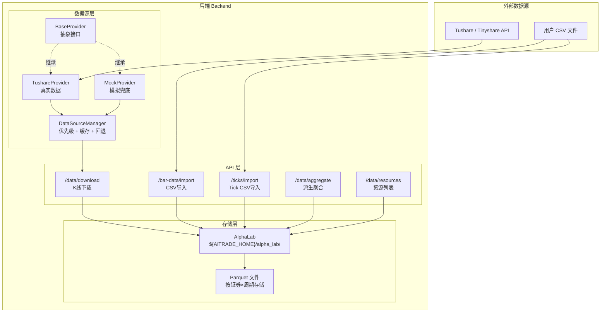
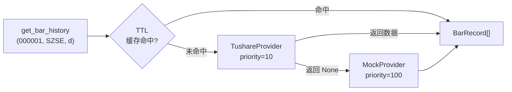
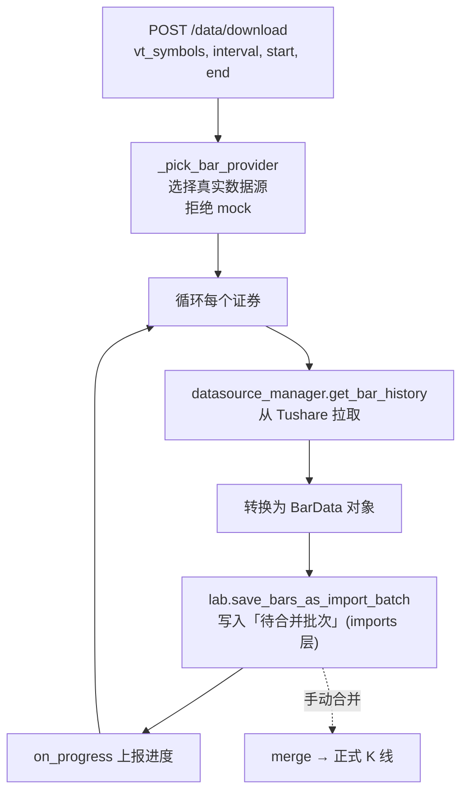
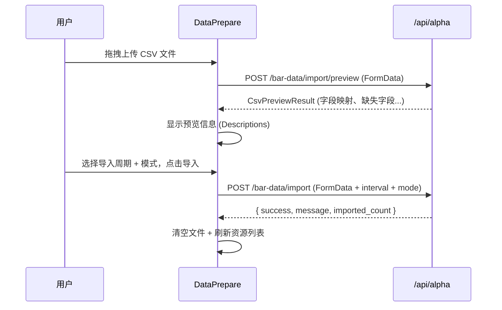
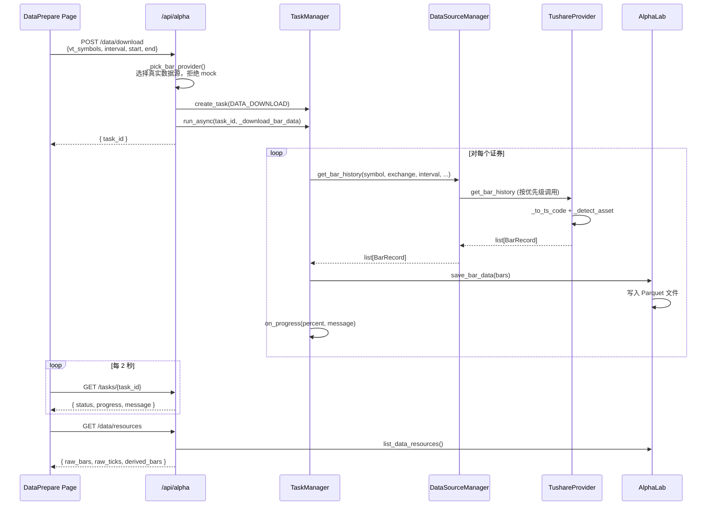
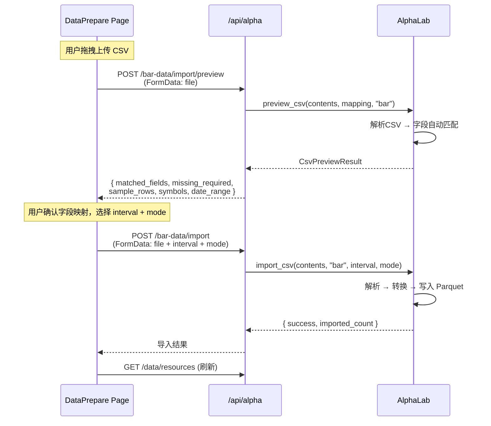
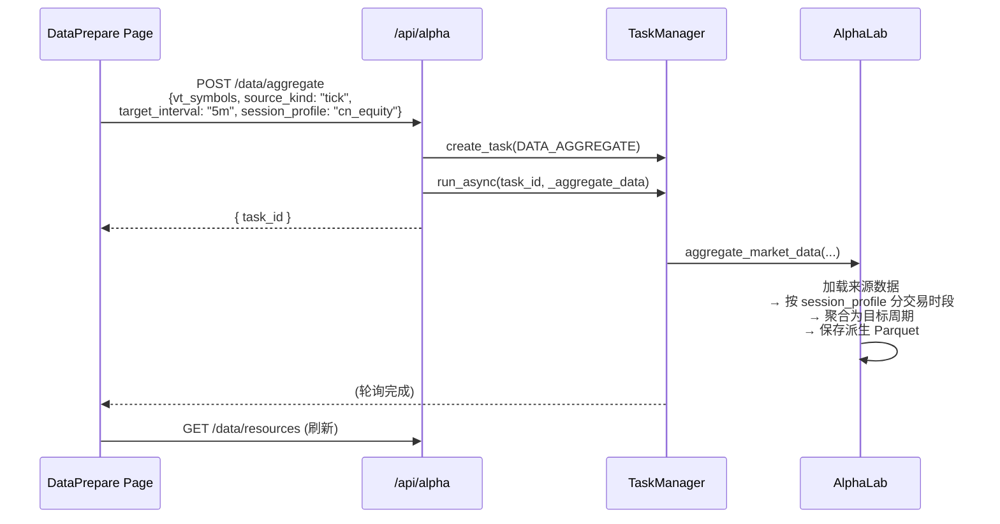
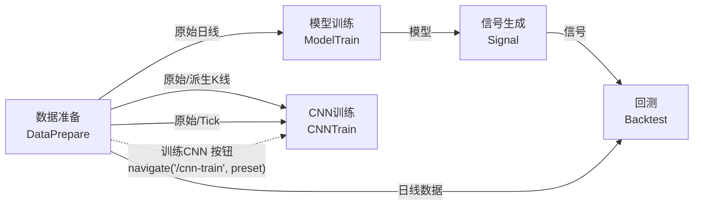

# 数据准备模块前后端代码深度阅读

## 一、模块总览与架构

数据准备模块是 AITrade 的**数据入口**，负责从外部数据源获取原始行情数据（K线/Tick），存储到本地，并提供派生周期聚合能力。它是所有下游模块（因子模型、CNN训练、回测）的基础前置步骤。

### 文件地图

```
后端 backend/aitrade/
├── config.py                          # 全局配置（存储路径、Tushare token、CSV映射等）
├── datasource/                        # ★ 数据源抽象层
│   ├── types.py                       #   统一数据类型定义
│   ├── base.py                        #   Provider 抽象基类
│   ├── tushare_provider.py            #   Tushare/Tinyshare 真实数据源
│   ├── mock_provider.py               #   Mock 模拟数据源（兜底降级）
│   └── manager.py                     #   多数据源管理器（优先级 + 回退链 + TTL 缓存）
├── api/alpha.py                       # ★ API 路由（数据下载/导入/聚合/资源管理）
│                                      #   （此文件是整个 Alpha 模块的大路由，1340行）
└── alpha/lab.py                       #   AlphaLab 数据持久化层

前端 frontend/src/
├── types/alpha.ts                     # TypeScript 类型定义
├── api/alpha.ts                       # Axios API 客户端封装
├── pages/DataPrepare/
│   ├── index.tsx                      # ★ 数据准备主页面（879行）
│   └── components/
│       ├── CsvImport.tsx              #   旧版 CSV 导入组件（独立子组件）
│       └── DataViewer.tsx             #   旧版数据查看器（Modal 弹窗）
├── hooks/useTask.ts                   # 任务状态轮询 Hook
└── components/TaskStatusPanel.tsx     # 任务进度展示组件
```

### 整体架构图



---

## 二、后端代码详解

### 2.1 数据类型层 — datasource/types.py

**文件**: [types.py](file:///Users/kevin_1/aitrade/backend/aitrade/datasource/types.py)

定义了所有数据源共享的 dataclass 类型：

| 类型 | 说明 | 关键字段 |
|------|------|----------|
| `DataCategory` | 数据源能力枚举 | `CONTRACT`, `BAR_HISTORY`, `TICK_HISTORY`, `TRADE_CALENDAR`, `FUNDAMENTAL`, `REFERENCE` |
| `ProviderStatus` | 数据源状态 | `AVAILABLE`, `DEGRADED`, `UNAVAILABLE`, `NOT_CONFIGURED` |
| `ContractInfo` | 合约元数据 | symbol, exchange, name, product_type, pricetick, list_date |
| `BarRecord` | K线记录 | symbol, exchange, datetime, interval, OHLCV, turnover |
| `TickRecord` | Tick记录 | symbol, exchange, datetime, last_price, bid/ask price/volume |
| `CalendarDay` | 交易日历 | date, exchange, is_open |
| `FundamentalRecord` | 基本面 | PE, PB, PS, 总市值, 流通市值, 换手率 |
| `ProviderInfo` | 数据源描述 | name, display_name, status, categories, priority |

> [!NOTE]
> `BarRecord` 和 `TickRecord` 是完全自包含的，不依赖 vnpy。这是项目从 vnpy 剥离后设计的统一数据格式。

---

### 2.2 数据源抽象基类 — datasource/base.py

**文件**: [base.py](file:///Users/kevin_1/aitrade/backend/aitrade/datasource/base.py)

`BaseProvider` 是一个 ABC，定义了所有数据源必须实现的接口：

```python
class BaseProvider(ABC):
    name: str = ""
    display_name: str = ""
    
    @abstractmethod
    def init(self, output) -> bool: ...      # 初始化连接
    
    @abstractmethod
    def get_status(self) -> ProviderStatus: ... # 获取状态
    
    @abstractmethod
    def get_supported_categories(self) -> list[DataCategory]: ...  # 支持的数据类别
    
    # 以下方法均有默认实现 return None（表示不支持）
    def get_contracts(...) -> list[ContractInfo] | None: ...
    def get_bar_history(...) -> list[BarRecord] | None: ...
    def get_tick_history(...) -> list[TickRecord] | None: ...
    def get_trade_calendar(...) -> list[CalendarDay] | None: ...
    def get_fundamental(...) -> list[FundamentalRecord] | None: ...
    def get_adj_factor(...) -> list[dict] | None: ...
```

**设计要点**：
- 3 个抽象方法必须实现：`init`、`get_status`、`get_supported_categories`
- 其余数据获取方法都有默认实现（返回 `None`），允许 Provider 选择性支持部分数据类型
- 返回 `None` 表示"不支持此功能"，与返回 `[]`（"支持但没有数据"）区分

---

### 2.3 Tushare 真实数据源 — tushare_provider.py

**文件**: [tushare_provider.py](file:///Users/kevin_1/aitrade/backend/aitrade/datasource/tushare_provider.py)

这是生产环境的主要数据来源，支持 **tushare** 和 **tinyshare** 两种后端（通过 `TUSHARE_BACKEND` 环境变量切换）。

#### 交易所代码映射

```python
# vnpy 交易所 → Tushare 后缀
VT_TO_TS_SUFFIX = {
    "SSE": "SH",     # 上交所
    "SZSE": "SZ",    # 深交所
    "CFFEX": "CFX",  # 中金所
    "SHFE": "SHF",   # 上期所
    "DCE": "DCE",    # 大商所
    "CZCE": "ZCE",   # 郑商所
    ...
}

# 例: "000001.SZSE" (vnpy格式) → "000001.SZ" (tushare格式)
```

#### 支持的数据类别

```python
[CONTRACT, BAR_HISTORY, TRADE_CALENDAR, FUNDAMENTAL, REFERENCE]
```

> [!WARNING]
> 注意 `TushareProvider` **不支持** `TICK_HISTORY`。历史 Tick 数据需要通过 CSV 导入功能获取。

#### K线获取逻辑

[get_bar_history](file:///Users/kevin_1/aitrade/backend/aitrade/datasource/tushare_provider.py#L246-L320) 的处理逻辑：

```
1. 将 vnpy 格式 symbol+exchange 转为 tushare 的 ts_code
2. 将 vnpy interval (d/1m/5m...) 转为 tushare freq (D/1min/5min...)
3. 自动检测资产类型：_detect_asset() 判断是股票(E)/指数(I)/基金(FD)/期货(FT)
4. 日线/周线 → 调用 pro_bar()
   分钟线   → 调用 stk_mins 接口（tinyshare 特有）
5. 转换日期格式 + 构建 BarRecord 列表 + 按时间排序
```

#### 资产类型检测

[_detect_asset](file:///Users/kevin_1/aitrade/backend/aitrade/datasource/tushare_provider.py#L569-L582) 的判断规则：

| exchange | symbol 前缀 | 资产类型 |
|----------|------------|---------|
| 期货交易所 | 任意 | `FT` (期货) |
| SSE | `5` 开头 | `FD` (基金) |
| SZSE | `1` 开头 | `FD` (基金) |
| SSE | `000` 开头 | `I` (指数) |
| SZSE | `399` 开头 | `I` (指数) |
| 其余 | | `E` (股票) |

#### 合约查询

支持 4 类合约查询，分别调用不同的 tushare 接口：

| 类型 | tushare 接口 | 方法 |
|------|-------------|------|
| 股票 | `stock_basic` | [_fetch_stock_contracts](file:///Users/kevin_1/aitrade/backend/aitrade/datasource/tushare_provider.py#L446-L472) |
| 指数 | `index_basic` | [_fetch_index_contracts](file:///Users/kevin_1/aitrade/backend/aitrade/datasource/tushare_provider.py#L474-L497) |
| 期货 | `fut_basic` | [_fetch_futures_contracts](file:///Users/kevin_1/aitrade/backend/aitrade/datasource/tushare_provider.py#L499-L538) |
| 基金 | `fund_basic` | [_fetch_fund_contracts](file:///Users/kevin_1/aitrade/backend/aitrade/datasource/tushare_provider.py#L540-L567) |

---

### 2.4 Mock 模拟数据源 — mock_provider.py

**文件**: [mock_provider.py](file:///Users/kevin_1/aitrade/backend/aitrade/datasource/mock_provider.py)

全功能兜底降级数据源，用于开发/演示。所有数据**随机生成**。

**预设合约**：贵州茅台、平安银行、50ETF、IF/IC 股指期货、螺纹钢、黄金、白银等 11 个常用合约。

**K线生成逻辑** ([get_bar_history](file:///Users/kevin_1/aitrade/backend/aitrade/datasource/mock_provider.py#L90-L144))：
- 以预设基础价格开始（如贵州茅台 1800.0）
- 每根 bar 的价格变化 = `random.gauss(0, base_price * 0.015)`（正态分布，标准差为基础价的 1.5%）
- 成交量在 1000-100000 之间随机
- 日线和周线自动跳过周末
- 最多生成 5000 根 bar

> [!IMPORTANT]
> 后端 API 在下载数据时会**拒绝使用 Mock 数据源**（参见 `_pick_bar_provider`），只允许 tushare/gateway 等真实数据源。Mock 主要用于其他测试场景。

---

### 2.5 数据源管理器 — datasource/manager.py

**文件**: [manager.py](file:///Users/kevin_1/aitrade/backend/aitrade/datasource/manager.py)

`DataSourceManager` 是数据源的**编排中心**，核心设计模式是**责任链 + TTL 缓存**。

#### 核心机制



**优先级路由** ([_resolve_providers](file:///Users/kevin_1/aitrade/backend/aitrade/datasource/manager.py#L112-L121))：
1. 按 `DataCategory` 筛选支持该类别的 Provider
2. 按 priority 升序排列（priority 值越小优先级越高）
3. 逐个尝试，第一个返回非 None 结果的 Provider 生效
4. 如果指定了 `provider_name`，直接使用指定的 Provider

**TTL 缓存** ([_CacheEntry](file:///Users/kevin_1/aitrade/backend/aitrade/datasource/manager.py#L44-L55))：

| 数据类别 | 缓存 TTL |
|----------|---------|
| contracts | 300 秒 (5分钟) |
| calendar | 3600 秒 (1小时) |
| fundamental | 600 秒 (10分钟) |
| adj_factor | 3600 秒 (1小时) |
| providers | 60 秒 (1分钟) |

> [!NOTE]
> **K线数据不做缓存**——因为 K 线请求的参数组合（symbol × interval × date range）太多，缓存命中率极低。

**全局单例**：`datasource_manager = DataSourceManager()` 在模块级别创建。

---

### 2.6 API 路由层 — api/alpha.py（数据准备部分）

**文件**: [alpha.py](file:///Users/kevin_1/aitrade/backend/aitrade/api/alpha.py)

这是一个 **1340 行**的大文件，包含整个 Alpha 模块的所有 API。数据准备相关的端点可分为 4 类：

#### A. 数据下载

| 端点 | 方法 | 功能 |
|------|------|------|
| `/api/alpha/data/download` | POST | 从 Tushare 下载原始 K 线 |
| `/api/alpha/data/aggregate` | POST | 本地数据聚合为派生周期 |

**下载流程** ([_download_bar_data](file:///Users/kevin_1/aitrade/backend/aitrade/api/alpha.py#L230-L314))：



**关键细节**：
- `_pick_bar_provider()` 只选择 `tushare` 或 `gateway`，**拒绝 mock** 数据源
- 支持的原始下载周期：`d`, `1m`, `5m`, `15m`, `30m`, `60m`, `w`
- `60m` 在 provider 层映射为 `1h`
- 当前版本**仅支持 K 线下载**，不支持直接下载 Tick（需 CSV 导入）
- **下载结果不再直接写正式 K 线**，而是落为 `source=download` 的待合并批次（与 CSV 上传同一批次机制），
  需在「数据资源 → K线批次」中合并校验通过后再并入正式资源（详见第八节）。
  返回体含 `saved_as: "import_batch"` 与 `batches` 列表。

**聚合流程** ([_aggregate_data](file:///Users/kevin_1/aitrade/backend/aitrade/api/alpha.py#L317-L344))：

```
POST /data/aggregate
  ↓
lab.aggregate_market_data(
    vt_symbols, source_kind, source_interval,
    target_interval, start, end, session_profile
)
```

支持两种聚合来源：
- `bar` → bar：例如 1 分钟 K 线聚合为 5 分钟
- `tick` → bar：例如原始 Tick 聚合为 5 分钟 K 线

#### B. CSV 导入

| 端点 | 方法 | 功能 |
|------|------|------|
| `/api/alpha/bar-data/import/preview` | POST | 预览 K 线 CSV（字段映射检查） |
| `/api/alpha/bar-data/import` | POST | 执行 K 线 CSV 导入 |
| `/api/alpha/ticks/import/preview` | POST | 预览 Tick CSV |
| `/api/alpha/ticks/import` | POST | 执行 Tick CSV 导入 |

**CSV 导入分为两步**：

```
步骤1: 预览 (preview)
  → 上传 CSV 文件
  → 后端自动匹配字段名（支持中英文，如 "close" / "收盘价"）
  → 返回: 字段映射、缺失字段、样本行、证券列表、日期范围

步骤2: 导入 (import)
  → 上传 CSV + 选择 interval + 选择导入模式 (merge/replace)
  → 后端解析并写入 Parquet
```

**字段映射规则** ([config.py](file:///Users/kevin_1/aitrade/backend/aitrade/config.py#L56-L72))：

```python
CSV_FIELD_MAPPING = {
    "datetime": ["datetime", "date", "trade_date", "时间", "交易日期"],
    "open":     ["open", "open_price", "开盘价"],
    "high":     ["high", "high_price", "最高价"],
    "close":    ["close", "close_price", "收盘价"],
    "volume":   ["volume", "vol", "成交量"],
    ...
}
CSV_REQUIRED_FIELDS = ["datetime", "open", "high", "low", "close"]
```

> [!TIP]
> CSV 导入支持多种中英文字段名自动匹配。用户不需要手动调整列名，只要 CSV 中包含 datetime、OHLC 等必填字段的任意一种写法即可。

#### C. 数据资源管理

| 端点 | 方法 | 功能 |
|------|------|------|
| `/api/alpha/data/resources` | GET | 获取所有数据资源列表 |
| `/api/alpha/data/resources/{kind}/{key}` | GET | 获取单个资源详情+预览 |
| `/api/alpha/data/resources/{kind}/{key}` | DELETE | 删除单个资源 |

资源按 3 类组织：
- `raw_bars`：原始 K 线（下载或 CSV 导入的）
- `raw_ticks`：原始 Tick（CSV 导入的）
- `derived_bars`：派生 K 线（本地聚合生成的）

#### D. 兼容旧接口

| 端点 | 方法 | 功能 |
|------|------|------|
| `/api/alpha/bar-data` | GET | 列出日线和分钟线（旧格式） |
| `/api/alpha/bar-data/{interval}/{vt_symbol}` | GET | 获取单个合约 K 线详情 |
| `/api/alpha/bar-data/{interval}/{vt_symbol}` | DELETE | 删除单个合约 K 线 |

> [!NOTE]
> 旧的 `bar-data` 端点仍保留，但新前端主要使用 `data/resources` 端点。旧端点会自动从新的资源列表中提取 daily/minute 数据返回。

---

### 2.7 全局配置 — config.py

**文件**: [config.py](file:///Users/kevin_1/aitrade/backend/aitrade/config.py)

| 配置项 | 默认值 | 说明 |
|--------|--------|------|
| `AITRADE_HOME` | `./.aitrade/` | 项目数据根目录 |
| `ALPHA_LAB_PATH` | `./.aitrade/alpha_lab/` | K线/数据集/模型存储 |
| `CNN_MODEL_PATH` | `./.aitrade/cnn_models/` | CNN 模型存储 |
| `TUSHARE_TOKEN` | 环境变量 | Tushare API Token |
| `TUSHARE_BACKEND` | `"tushare"` | 可切换为 `"tinyshare"` |
| `MAX_WORKERS` | `4` | 并行特征计算线程数 |
| `API_HOST` | `0.0.0.0` | API 监听地址 |
| `API_PORT` | `8000` | API 端口 |

---

## 三、前端代码详解

### 3.1 TypeScript 类型 — types/alpha.ts

**文件**: [alpha.ts](file:///Users/kevin_1/aitrade/frontend/src/types/alpha.ts)

数据准备相关的核心类型：

```typescript
// 数据资源三分类
type DataResourceKind = 'raw_bar' | 'raw_tick' | 'derived_bar'

// 资源摘要（列表页使用）
interface DataResourceSummary {
  key: string                    // 资源唯一标识
  kind: DataResourceKind
  vt_symbol: string              // 证券代码
  interval: string               // 原始周期
  row_count: number
  start: string
  end: string
  file_size_kb: number
  source_kind: string            // 来源类型
  source_interval: string        // 来源周期
  target_interval: string        // 目标周期（派生时）
  created_at?: string | null
  session_profile?: string       // 交易时段规则
}

// 资源列表响应
interface DataResourceList {
  raw_bars: DataResourceSummary[]
  raw_ticks: DataResourceSummary[]
  derived_bars: DataResourceSummary[]
  raw_bar_intervals: string[]    // 已有的原始K线周期
  derived_intervals: string[]    // 已有的派生周期
}

// CSV 预览结果
interface CsvPreviewResult {
  columns: string[]
  sample_rows: Record<string, unknown>[]
  matched_fields: Record<string, string>   // 标准字段 → CSV列名 映射
  unmapped_columns: string[]               // 未识别的列
  missing_required: string[]               // 缺失的必填字段
  total_rows: number
  date_range: [string, string]
  symbols: string[]
}
```

### 3.2 API 客户端 — api/alpha.ts

**文件**: [alpha.ts](file:///Users/kevin_1/aitrade/frontend/src/api/alpha.ts)

数据准备相关的 API 方法：

```typescript
export const alphaService = {
  // === 数据下载 ===
  downloadData: (req) => api.post('/api/alpha/data/download', req),
  aggregateData: (req) => api.post('/api/alpha/data/aggregate', req),
  
  // === 数据资源 ===
  getDataResources: () => api.get('/api/alpha/data/resources'),
  getDataResourceDetail: (kind, key, query?) => api.get(`/api/alpha/data/resources/${kind}/${key}`),
  deleteDataResource: (kind, key) => api.delete(`/api/alpha/data/resources/${kind}/${key}`),
  
  // === CSV 导入（K线） ===
  previewCsvImport: (file, mapping?) => {
    const formData = new FormData()
    formData.append('file', file)
    return api.post('/api/alpha/bar-data/import/preview', formData)
  },
  importCsvData: (file, interval, mode, mapping?) => {
    const formData = new FormData()
    formData.append('file', file)
    formData.append('interval', interval)     // d/1m/5m/...
    formData.append('import_mode', mode)      // merge/replace
    return api.post('/api/alpha/bar-data/import', formData)
  },
  
  // === CSV 导入（Tick） ===
  previewTickCsvImport: (file) => api.post('/api/alpha/ticks/import/preview', formData),
  importTickCsvData: (file, mode) => api.post('/api/alpha/ticks/import', formData),
  
  // === 任务管理 ===
  listTasks: () => api.get('/api/alpha/tasks'),
  getTask: (taskId) => api.get(`/api/alpha/tasks/${taskId}`),
}
```

> [!NOTE]
> CSV 导入使用 `FormData` 上传文件，Axios 的请求拦截器会自动移除 `Content-Type`，让浏览器设置正确的 `multipart/form-data` boundary。

### 3.3 数据准备主页面 — DataPrepare/index.tsx ★

**文件**: [index.tsx](file:///Users/kevin_1/aitrade/frontend/src/pages/DataPrepare/index.tsx)（879 行）

这是数据准备模块的核心页面，采用**上下两段、左右分栏**的布局。

#### 页面布局

```
┌───────────────────────────────────────────────────────────────┐
│  数据准备工作台 (Title)                                        │
│  上方先准备原始数据和资源... (描述)                              │
├───────────────────────────────────────────────────────────────┤
│ ┌──────┐ ┌──────┐ ┌──────┐ ┌──────┐                          │
│ │原始K线│ │历史Tick│ │派生周期│ │ 总行数│   ← 4 个统计卡片       │
│ │  12  │ │   3  │ │   8  │ │ 245K │                          │
│ └──────┘ └──────┘ └──────┘ └──────┘                          │
├───────────────────────────────────────────────────────────────┤
│  [TaskStatusPanel] 当前任务进度                                │
├───────────────────────────────────────────────────────────────┤
│                                                               │
│  ┌─ 左栏 (xl=8) ──────────┐  ┌─ 右栏 (xl=16) ──────────────┐ │
│  │ 原始数据获取             │  │ 数据资源区                    │ │
│  │ ┌─────────────────────┐ │  │                              │ │
│  │ │ Tabs:               │ │  │ Tabs:                        │ │
│  │ │ · K线下载            │ │  │ · 原始K线 (12)               │ │
│  │ │   - 合约列表         │ │  │ · 原始Tick (3)               │ │
│  │ │   - 下载周期         │ │  │ · 派生周期 (8)               │ │
│  │ │   - 时间范围         │ │  │                              │ │
│  │ │   [启动下载]         │ │  │ [ResourceTable]              │ │
│  │ │ · K线CSV             │ │  │  资源信息 / 区间 / 数据量     │ │
│  │ │   - 拖拽上传         │ │  │  / 操作(预览/训练CNN/删除)   │ │
│  │ │   - 导入周期+模式    │ │  │                              │ │
│  │ │   [导入K线 CSV]      │ │  └──────────────────────────────┘ │
│  │ │ · Tick导入            │ │                                 │
│  │ │   - 拖拽上传         │ │                                 │
│  │ │   [导入历史 Tick]     │ │                                 │
│  │ └─────────────────────┘ │                                 │
│  └─────────────────────────┘                                 │
│                                                               │
│  ┌─ 左栏 (xl=8) ──────────┐  ┌─ 右栏 (xl=16) ──────────────┐ │
│  │ 本地聚合工作区           │  │ 资源预览                      │ │
│  │ · 合约列表              │  │ [Descriptions: 行数/大小/...]  │ │
│  │ · 来源类型 (bar/tick)   │  │ [Table: 数据样本预览]         │ │
│  │ · 来源周期 (条件显示)   │  │                              │ │
│  │ · 目标周期              │  └──────────────────────────────┘ │
│  │ · 时间范围              │                                 │
│  │ · 时段规则              │                                 │
│  │ [生成派生周期]          │                                 │
│  └─────────────────────────┘                                 │
└───────────────────────────────────────────────────────────────┘
```

#### 核心状态管理

```typescript
// 3 个 Form 实例
const [downloadForm] = Form.useForm()    // K线下载表单
const [barImportForm] = Form.useForm()   // K线CSV导入表单
const [aggregateForm] = Form.useForm()   // 本地聚合表单

// 本地 state
const [taskId, setTaskId] = useState<string | null>(null)
const [selectedResource, setSelectedResource] = useState<DataResourceSummary | null>(null)
const [barCsvFile, setBarCsvFile] = useState<UploadFile[]>([])
const [tickCsvFile, setTickCsvFile] = useState<UploadFile[]>([])
const [barPreview, setBarPreview] = useState<CsvPreviewResult | null>(null)
const [tickPreview, setTickPreview] = useState<CsvPreviewResult | null>(null)

// React Query
const task = useTask(taskId)                               // 任务轮询
const { data: resources } = useQuery(['alpha-data-resources'])  // 资源列表
const { data: resourceDetail } = useQuery(                      // 资源详情
  ['alpha-data-resource-detail', kind, key],
  { enabled: !!selectedResource }
)
```

#### 关键交互逻辑

**1. K 线下载** ([handleDownload](file:///Users/kevin_1/aitrade/frontend/src/pages/DataPrepare/index.tsx#L348-L366))：

```
用户填写 → validateFields() → 解析证券列表 → alphaService.downloadData()
→ 返回 task_id → setTaskId → useTask 开始轮询 → 完成后刷新资源列表
```

**2. CSV 预览 + 导入** ([previewCsv](file:///Users/kevin_1/aitrade/frontend/src/pages/DataPrepare/index.tsx#L389-L406) + [handleImport](file:///Users/kevin_1/aitrade/frontend/src/pages/DataPrepare/index.tsx#L438-L484))：



**3. 本地聚合** ([handleAggregate](file:///Users/kevin_1/aitrade/frontend/src/pages/DataPrepare/index.tsx#L368-L387))：

```
用户选择来源类型+周期+目标周期 → aggregateData()
→ 返回 task_id → 轮询进度 → 完成后刷新资源列表
```

**4. 资源预览** ([previewCard](file:///Users/kevin_1/aitrade/frontend/src/pages/DataPrepare/index.tsx#L512-L569))：

当用户在资源列表中点击某个资源时：
- 设置 `selectedResource` → 触发 React Query 加载详情
- 展示 Descriptions（行数/文件大小/起止时间/来源说明）
- 展示 Table（最近 60 行数据样本）

**5. 跳转 CNN 训练** ([handleTrainWithResource](file:///Users/kevin_1/aitrade/frontend/src/pages/DataPrepare/index.tsx#L499-L510))：

```typescript
navigate('/cnn-train', {
  state: {
    preset: {
      target_symbol: resource.vt_symbol,
      input_data_kind: resource.kind === 'raw_tick' ? 'tick' : 'bar',
      input_interval: resource.target_interval || resource.interval,
      symbols: [resource.vt_symbol],
    },
  },
})
```

> [!TIP]
> 资源表格每行都有一个"训练CNN"按钮，点击后会自动将当前资源的证券/类型/周期作为预设值传递到 CNN 训练页面。

#### ResourceTable 子组件

[ResourceTable](file:///Users/kevin_1/aitrade/frontend/src/pages/DataPrepare/index.tsx#L190-L280) 是一个通用的数据资源表格组件：

| 列 | 内容 | 说明 |
|----|------|------|
| 资源信息 | 证券名 + 类型Tag + 周期Tag + 来源说明 | 280px 宽，Tag 颜色区分 raw/tick/derived |
| 区间 | 起止时间 + 生成时间 | 格式化显示，日线/分钟/Tick 格式不同 |
| 数据量 | 行数 + 文件大小 | `Intl.NumberFormat` 格式化 |
| 操作 | 预览 / 训练CNN / 删除 | Tick 资源无"训练CNN"按钮 |

#### 资源排序逻辑

[sortResources](file:///Users/kevin_1/aitrade/frontend/src/pages/DataPrepare/index.tsx#L159-L183) 按以下优先级排序：

```
1. 创建时间（新的在前）
2. 周期优先级（tick < 1m < 5m < ... < d）
3. 结束时间（新的在前）
4. 行数（多的在前）
5. 证券代码字母序
```

---

### 3.4 旧版子组件

#### CsvImport.tsx

**文件**: [CsvImport.tsx](file:///Users/kevin_1/aitrade/frontend/src/pages/DataPrepare/components/CsvImport.tsx)（289 行）

独立的 CSV 导入组件，英文界面，包含：
- Dragger 上传区
- 字段映射展示表格（标准字段 → CSV 列名）
- 样本数据预览（前 5 行）
- Interval 选择（Daily/Minute）
- Import Mode 选择（Merge/Replace）

> [!NOTE]
> 此组件看起来是早期版本的实现。当前主页面 `index.tsx` 已经将 CSV 导入功能内联到了 Tabs 中（支持 K 线 CSV 和 Tick CSV 两种），这个独立组件可能已经不再使用。

#### DataViewer.tsx

**文件**: [DataViewer.tsx](file:///Users/kevin_1/aitrade/frontend/src/pages/DataPrepare/components/DataViewer.tsx)（325 行）

一个 Modal 弹窗形式的数据查看器，包含：
- `DataViewer` 组件：Modal 中展示数据详情（摘要 + 列信息 + 数据预览表格）
- `DataStats` 组件：统计卡片（Total Symbols / Daily Count / Minute Count / Total Rows）
- `DataListView` 组件：合并 daily/minute 数据的列表视图

> [!NOTE]
> 与 `CsvImport.tsx` 类似，此组件也是旧版实现。当前 `index.tsx` 使用内联的 `previewCard` 和 `ResourceTable` 替代了这些功能。

---

## 四、完整数据流

### 4.1 K 线下载数据流



### 4.2 CSV 导入数据流



### 4.3 本地聚合数据流



---

## 五、数据存储结构

所有数据存储在 `AITRADE_HOME/alpha_lab/` 下，以 **Parquet** 格式按证券×周期组织：

```
${AITRADE_HOME}/
├── alpha_lab/
│   ├── daily/                  # 原始日线
│   │   ├── 000001.SZSE.parquet
│   │   └── 600519.SSE.parquet
│   ├── minute/                 # 原始分钟线
│   │   └── 000001.SZSE.parquet
│   ├── tick/                   # 原始 Tick
│   │   └── 000001.SZSE.parquet
│   ├── derived/                # 派生周期
│   │   ├── 5m/
│   │   │   └── 000001.SZSE.parquet
│   │   └── 10m/
│   │       └── 000001.SZSE.parquet
│   ├── datasets/               # Alpha 数据集
│   ├── models/                 # Alpha 模型
│   └── signals/                # 交易信号
└── cnn_models/                 # CNN 模型（独立于 alpha_lab）
    ├── model_v1.pt
    └── model_v1_history.json
```

---

## 六、模块间关联

数据准备模块是其他所有模块的上游：



- **模型训练**（Alpha 因子模型）：需要原始日线数据
- **CNN 训练**：需要任意原始/派生 K 线或 Tick 数据
- **信号生成**：需要模型 + 日线数据
- **回测**：需要信号 + 日线数据

数据准备页面的 `ResourceTable` 中每行的"训练CNN"按钮，直接通过 `react-router` 的 `navigate` 跳转到 CNN 训练页面，并携带当前资源的预设值（`target_symbol`、`input_data_kind`、`input_interval`）。

---

## 七、K 线时间戳约定（重要）

全链路 K 线时间戳统一为 **「区间结束时刻」（end-labeled）**，与下载源（Tushare `trade_time` / AKShare `时间`）一致：

- 一根标注为 `09:35` 的 5 分钟 K 线，覆盖 `(09:30, 09:35]` 的成交。
- 本地聚合（`aggregate_bar_frame` / `aggregate_tick_frame_to_bars`）的输出按结束时刻标注：
  - **bar 来源**：源分钟线已按结束时刻标注，向上取整（ceil）到目标边界；开盘 `09:30` 快照与首根分钟线一并并入首桶。
  - **tick 来源**：事件时刻先按 `[start, end)` 落桶，再以桶结束时刻标注。
- **午盘 / 收盘整点**（`11:30` / `15:00`）并入该交易时段最后一个桶（右闭），收盘集合竞价不再丢失。
- **末尾不完整桶**：bar 来源若缺少收盘分钟（如数据截断于 `10:18`），末尾"半根 K 线"会被剔除，并在派生 metadata 记 `dropped_incomplete`；tick 来源不做此剔除（事件数据无固定成分根数）。
- 派生数据 metadata 增加 `ts_convention: "end"` 字段以便下游断言。

> [!WARNING]
> 上述约定修正了此前聚合误用"起始时刻 + 左闭右开"导致的整体错位与边界丢弃问题。
> **存量派生数据需删除后重新聚合**，存量原始数据如为旧约定也建议重新下载/导入，否则新旧数据时间轴语义不一致。

---

## 八、下载/导入 → 批次 → 合并 流程（重要）

为避免脏数据/断档直接污染正式 K 线，**下载与 CSV 上传都先落为「待合并批次」（imports 层）**，
由用户在「数据资源 → K线批次 / Tick批次」中执行合并，校验通过后才并入正式资源（bars/ticks 层）。

### 批次来源
- `source=download`：`/data/download` 拉取的数据，每个合约一个批次；
- `source=upload`：CSV 导入（`save_mode=batch`，页面默认）。
- 批次 metadata 记录 `adjust_type`（复权口径）与 `source`，供合并时审计与校验。

### 合并参与方
合并的「基底」= **现有正式资源（若存在）+ 选中的批次**：
- 已有正式资源时，可只选 **1 个**重叠批次并入并向后/向前扩展；
- 无正式资源时，单个批次可直接**晋级**为正式资源（无需重叠）。

### 合并校验规则（`_build_merge_plan`）
1. **同合约、同周期**：混合则拒绝；
2. **复权口径一致**：批次之间及与现有正式资源的 `adjust_type` 不一致则拒绝（防止除权跳变污染）；
3. **必须重叠**：参与方 ≥ 2 时要求存在公共重叠区间（**日线同样要求**），无重叠视为拼接而拒绝；
4. **重叠区一致**：重叠时间点的 OHLC/量额必须完全一致，存在冲突（`conflict_count > 0`）则拒绝；
5. **分钟线连续**：合并结果在 A 股交易小节（09:30–11:30 / 13:00–15:00）内不得断档，午休与跨日天然允许断开。

预检 `POST /data/resources/merge/preview` 与执行 `POST /data/resources/merge` 共用同一套 `_build_merge_plan`，
确保「确认框所见 = 实际写入」。预检返回新增 `has_official`（是否有正式基底）字段。

> [!NOTE]
> 旧版「冲突时后上传批次覆盖先上传」的策略已废弃：重叠区不一致现在直接**拒绝合并**，
> 需先确认两侧数据源/复权口径一致后再重试。

### Parquet 文件夹批量上传

parquet 是本仓库 K 线/Tick 的原生存储格式，因此除 CSV 外，K 线/Tick 上传区还支持直接上传
`.parquet`，并可**一次多选 / 整文件夹批量上传多支股票**。整条链路与 CSV 一样落到 imports 待合并批次，
只是省去解析、走"暂存→预览→确认"三步以兼顾大体量与"先看后导"：

1. **暂存**（`POST /api/alpha/parquet/stage`）：所选文件**流式分块落盘**到暂存目录
   `<AITRADE_HOME>/_uploads/<session_id>/`（内存恒定，不一次性读入；刻意在数据资源扫描范围之外），
   返回会话 ID 与逐文件预览（识别代码 / 行数 / 时间范围 / 缺列 / 是否可导入）。预览只读 parquet
   元数据与时间列，不全表加载。
2. **确认**：页面以汇总表展示逐文件预览（不可导入项标红），选周期（bar）与导入模式后点「确认导入」。
3. **导入**（`POST /api/alpha/parquet/import`）：创建异步任务（`TaskType.DATA_IMPORT`）逐文件规范化为标准
   K 线/Tick 帧并落为待合并批次，按 `(i/total)` 报进度，完成后清理暂存目录；单文件失败隔离、计入
   `failed_files` 不拖垮整批。随后在「数据资源 → 批次」走既有合并流程并入正式资源。

**证券代码识别**：默认按**文件名**经 `canonical_vt_symbol_from_stem` 推断（裸编号自动补交易所，如
`000001.parquet→000001.SZSE`、`600000.parquet→600000.SSE`）；若文件内含 `vt_symbol`/`symbol` 列则改按列
分组（支持单文件多支股票）。**列字段映射**复用 CSV 的 `parse_csv_mapping`（兼容中英文别名）；必填字段
bar=`datetime/open/high/low/close`、tick=`datetime/last_price`，缺列即标不可导入。

**约束与安全**：单文件 / 单次总量分别受 `PARQUET_UPLOAD_MAX_FILE_BYTES`（默认 512MB）/
`PARQUET_UPLOAD_MAX_TOTAL_BYTES`（默认 4GB）限制，超限拒绝并清理本会话；暂存目录超
`PARQUET_UPLOAD_TTL`（默认 24h）由新会话创建时回收，用户取消即删；`session_id` 与代码均做路径穿越校验，
导入只写 imports 层、绝不直接污染正式资源。详见 `.kiro/specs/data-prepare-parquet-upload/`。
