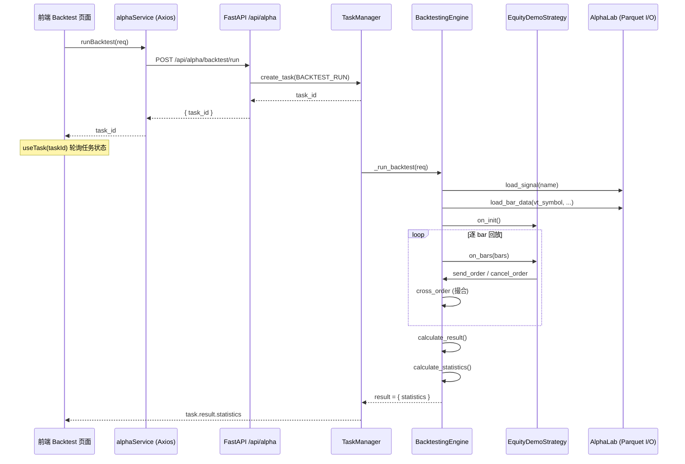
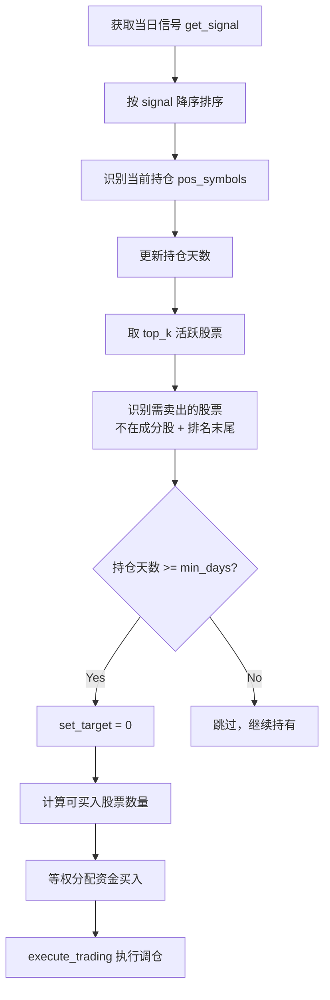

# AITrade 数据回测模块 —— 前后端代码深度阅读

> 本文档对「策略回测」功能从数据模型 → 后端引擎 → API 路由 → 前端页面进行逐层解读。

---

## 一、整体架构 & 数据流



**核心思路**：前端发起回测请求 → 后端将其包装为异步任务 → 回测引擎加载信号 + 历史 K 线 → 按时间顺序驱动策略 → 撮合订单 → 逐日盯市 → 计算统计指标 → 返回前端展示。

---

## 二、后端代码详解

### 2.1 数据模型层 — Pydantic

**文件**: [alpha.py](file:///Users/kevin_1/aitrade/backend/aitrade/models/alpha.py)

#### BacktestRunRequest (L101-L108)

```python
class BacktestRunRequest(BaseModel):
    """Strategy backtest request."""
    name: str             # 回测名称（用于结果标识）
    signal: str           # 关联的信号名称（从 AlphaLab 加载）
    capital: float = 1_000_000   # 初始资金
    start: date           # 回测开始日期
    end: date             # 回测结束日期
    benchmark: Optional[str] = None  # 基准合约（可选，当前 API 未使用）
```

> [!NOTE]
> `signal` 是回测的关键输入。它是上游 "信号生成" 步骤的产出物——一个 Polars DataFrame，包含 `datetime`, `vt_symbol`, `signal` 三列，表示每个时间点每只股票的预测信号强度。

#### TaskType 枚举 (L28)

```python
BACKTEST_RUN = "backtest_run"
```

这使回测任务与下载、训练等任务共享同一套 [TaskManager](file:///Users/kevin_1/aitrade/backend/aitrade/task/manager.py) 生命周期管理。

---

### 2.2 策略模板层

**文件**: [template.py](file:///Users/kevin_1/aitrade/backend/aitrade/alpha/strategy/template.py) (281 行)

#### 基础数据类 (L25-L96)

| 类 | 职责 |
|---|---|
| [OrderData](file:///Users/kevin_1/aitrade/backend/aitrade/alpha/strategy/template.py#L25-L61) | 订单信息（symbol, exchange, direction, offset, price, volume, status） |
| [TradeData](file:///Users/kevin_1/aitrade/backend/aitrade/alpha/strategy/template.py#L64-L96) | 成交信息（在 OrderData 基础上增加 tradeid） |
| [Direction](file:///Users/kevin_1/aitrade/backend/aitrade/alpha/strategy/template.py#L15-L17) | 方向常量：`LONG` / `SHORT` |
| [Offset](file:///Users/kevin_1/aitrade/backend/aitrade/alpha/strategy/template.py#L20-L22) | 开平常量：`OPEN` / `CLOSE` |

> [!TIP]
> `vt_symbol` 是虚拟合约标识，格式为 `symbol.exchange`（如 `000001.SZSE`），通过 `@property` 动态拼接。`vt_orderid` = `gateway_name.orderid`。

#### AlphaStrategy 抽象基类 (L103-L281)

这是所有策略的**模板类**，采用经典的事件驱动设计：

```python
class AlphaStrategy(metaclass=ABCMeta):
    def __init__(self, strategy_engine, strategy_name, vt_symbols, setting):
        self.pos_data: dict[str, float] = defaultdict(float)     # 实际持仓
        self.target_data: dict[str, float] = defaultdict(float)  # 目标持仓
        self.orders: dict[str, OrderData] = {}
        self.active_orderids: set[str] = set()
```

**三个必须实现的抽象方法**：

| 方法 | 触发时机 | 用途 |
|---|---|---|
| [on_init()](file:///Users/kevin_1/aitrade/backend/aitrade/alpha/strategy/template.py#L128-L131) | 策略加载时 | 初始化内部状态 |
| [on_bars(bars)](file:///Users/kevin_1/aitrade/backend/aitrade/alpha/strategy/template.py#L133-L136) | 每根 bar 推送时 | 核心交易逻辑 |
| [on_trade(trade)](file:///Users/kevin_1/aitrade/backend/aitrade/alpha/strategy/template.py#L138-L141) | 成交回报时 | 成交后处理 |

**内置的交易方法**：

```python
buy(vt_symbol, price, volume)    # 买入开仓 → LONG + OPEN
sell(vt_symbol, price, volume)   # 卖出平仓 → SHORT + CLOSE
short(vt_symbol, price, volume)  # 卖出开仓 → SHORT + OPEN
cover(vt_symbol, price, volume)  # 买入平仓 → LONG + CLOSE
```

**核心辅助方法 [execute_trading](file:///Users/kevin_1/aitrade/backend/aitrade/alpha/strategy/template.py#L218-L260)**：

这是"目标仓位"驱动交易的核心，逻辑如下：
1. 先 `cancel_all()` 取消所有活跃订单
2. 对每个合约，计算 `diff = target - pos`
3. `diff > 0` → 需要加仓（先 cover 再 buy）
4. `diff < 0` → 需要减仓（先 sell 再 short）
5. `price_add` 参数控制滑点容忍度

---

### 2.3 策略实现 — EquityDemoStrategy

**文件**: [equity_demo_strategy.py](file:///Users/kevin_1/aitrade/backend/aitrade/alpha/strategy/strategies/equity_demo_strategy.py) (90 行)

这是一个**股票多头等权轮动策略**：

```python
class EquityDemoStrategy(AlphaStrategy):
    top_k: int = 50        # 持仓数量上限
    n_drop: int = 5        # 从排名尾部剔除的数量
    min_days: int = 3      # 最小持仓天数（防频繁换手）
    cash_ratio: float = 0.95  # 可用资金比例
    min_volume: int = 100  # 最小买入手数
```

**[on_bars](file:///Users/kevin_1/aitrade/backend/aitrade/alpha/strategy/strategies/equity_demo_strategy.py#L33-L89) 核心逻辑流**：



> [!IMPORTANT]
> 这个策略**每个 bar 都根据最新信号重新排名**，采用 "sell → buy" 的顺序先计算卖出回笼资金，再分配给新买入标的。`min_days` 约束防止了 T+0 频繁调仓。

---

### 2.4 回测引擎 — BacktestingEngine

**文件**: [backtesting.py](file:///Users/kevin_1/aitrade/backend/aitrade/alpha/strategy/backtesting.py) (909 行)

这是整个回测系统的**核心驱动**，负责数据加载、事件驱动、订单撮合和统计计算。

#### 初始化 & 参数设置 (L30-L106)

```python
def __init__(self, lab: AlphaLab):
    self.vt_symbols: list[str] = []   # 标的池
    self.history_data: dict[tuple, BarData] = {}  # (datetime, vt_symbol) → BarData
    self.dts: set[datetime] = set()   # 所有唯一时间点
    self.limit_orders / self.active_limit_orders  # 订单管理
    self.trades: dict[str, TradeData] = {}  # 成交记录
    self.daily_results: dict[date, PortfolioDailyResult] = {}  # 逐日结果
    self.cash: float  # 当前可用现金
```

[set_parameters](file:///Users/kevin_1/aitrade/backend/aitrade/alpha/strategy/backtesting.py#L73-L106) 方法：
- 加载合约配置（手续费率、合约乘数、最小价格变动）
- 如果找不到配置会 **warning 但不中断**

#### 数据加载 [load_data](file:///Users/kevin_1/aitrade/backend/aitrade/alpha/strategy/backtesting.py#L115-L149)

```python
for vt_symbol in tqdm(self.vt_symbols):
    data = self.lab.load_bar_data(vt_symbol, self.interval, self.start, self.end)
    for bar in data:
        self.dts.add(bar.datetime)
        self.history_data[(bar.datetime, vt_symbol)] = bar
```

> 按 `(datetime, vt_symbol)` 的元组作为 key 存储全部历史 bar，`dts` 集合收集所有唯一时间戳。

#### 回测主循环 [run_backtesting](file:///Users/kevin_1/aitrade/backend/aitrade/alpha/strategy/backtesting.py#L151-L168)

```python
def run_backtesting(self):
    self.strategy.on_init()     # 1. 策略初始化
    dts = sorted(list(self.dts))  # 2. 时间排序

    for dt in dts:              # 3. 逐 bar 驱动
        self.new_bars(dt)       # → cross_order → strategy.on_bars → update_daily_close
```

#### 逐 bar 推送 [new_bars](file:///Users/kevin_1/aitrade/backend/aitrade/alpha/strategy/backtesting.py#L555-L589)

```python
def new_bars(self, dt):
    # 1. 对每个标的，获取该时间的 bar（无数据则用前收盘价填充）
    # 2. cross_order() — 先撮合上一轮挂出的限价单
    # 3. strategy.on_bars(bars) — 推送数据给策略
    # 4. update_daily_close() — 更新逐日收盘价记录
```

> [!NOTE]
> **先撮合再推数据**的设计意味着：策略在 bar N 发出的订单，在 bar N+1 时以 bar N+1 的价格撮合，模拟了 T+1 的实际延迟。

#### 订单撮合 [cross_order](file:///Users/kevin_1/aitrade/backend/aitrade/alpha/strategy/backtesting.py#L591-L672)

```python
def cross_order(self):
    for order in list(self.active_limit_orders.values()):
        bar = self.bars[order.vt_symbol]

        # 涨跌停价计算（前收盘 ±10%）
        limit_up = round_to(pre_close * 1.1, pricetick)
        limit_down = round_to(pre_close * 0.9, pricetick)

        # 多单成交条件：order.price >= 当日最低价 & 非涨停
        long_cross = (order.direction == LONG and order.price >= bar.low_price ...)

        # 成交价取 min(order.price, 开盘价) 或 max(order.price, 开盘价)
        if long_cross:
            trade_price = min(order.price, bar.open_price)

        # 更新现金：买入扣款、卖出回笼，双向扣手续费
        self.cash -= trade_turnover  # 买入
        self.cash += trade_turnover  # 卖出
        self.cash -= trade_commission
```

> [!IMPORTANT]
> 撮合价格逻辑：
> - **买入**：以「委托价 vs 开盘价」的**较小值**成交（保守估计）
> - **卖出**：以「委托价 vs 开盘价」的**较大值**成交
> - 这避免了回测中的"作弊"——不会以优于开盘价的价格成交

#### 信号获取 [get_signal](file:///Users/kevin_1/aitrade/backend/aitrade/alpha/strategy/backtesting.py#L674-L686)

```python
def get_signal(self):
    dt = self.datetime.replace(tzinfo=None)
    signal = self.signal_df.filter(pl.col("datetime") == dt)
    return signal
```

> 策略通过 `self.get_signal()` 获取当前时间点的信号 DataFrame，包含所有股票的 `signal` 值。

#### 逐日盯市 [calculate_result](file:///Users/kevin_1/aitrade/backend/aitrade/alpha/strategy/backtesting.py#L170-L226)

将成交分配到每一天的 `PortfolioDailyResult`，然后链式传递 `pre_closes` 和 `start_poses`：

```python
for daily_result in self.daily_results.values():
    daily_result.calculate_pnl(pre_closes, start_poses, sizes, rates)
    pre_closes = daily_result.close_prices   # 传给下一天
    start_poses = daily_result.end_poses
```

输出的 daily_df 包含：`date, trade_count, turnover, commission, trading_pnl, holding_pnl, total_pnl, net_pnl`

#### 统计指标计算 [calculate_statistics](file:///Users/kevin_1/aitrade/backend/aitrade/alpha/strategy/backtesting.py#L228-L389)

计算的关键指标及公式：

| 指标 | 计算方式 |
|---|---|
| `balance` | `cumsum(net_pnl) + capital` |
| `drawdown` | `balance - cummax(balance)` |
| `ddpercent` | `(balance / cummax(balance) - 1) × 100` |
| `total_return` | `(end_balance / capital - 1) × 100` |
| `annual_return` | `total_return / total_days × 240` |
| `sharpe_ratio` | `(daily_return - daily_risk_free) / return_std × √240` |
| `return_drawdown_ratio` | `-total_net_pnl / max_drawdown` |

> [!WARNING]
> 如果 `balance ≤ 0`（爆仓），统计指标将全部返回 0 值。

---

### 2.5 盈亏计算辅助类

#### [ContractDailyResult](file:///Users/kevin_1/aitrade/backend/aitrade/alpha/strategy/backtesting.py#L769-L836) — 单合约日度盈亏

```
holding_pnl = start_pos × (close - pre_close) × size    # 持仓盈亏
trading_pnl = Σ pos_change × (close - trade_price) × size  # 交易盈亏
commission  = Σ turnover × rate                           # 手续费
net_pnl     = total_pnl - commission                      # 净盈亏
```

#### [PortfolioDailyResult](file:///Users/kevin_1/aitrade/backend/aitrade/alpha/strategy/backtesting.py#L839-L909) — 组合日度盈亏

汇总所有合约的 `ContractDailyResult`，对 trade_count、turnover、commission、各类 pnl 求和。

---

### 2.6 API 路由层

**文件**: [alpha.py](file:///Users/kevin_1/aitrade/backend/aitrade/api/alpha.py)

#### 路由端点 (L993-L1006)

```python
@router.post("/backtest/run")
async def start_backtest(req: BacktestRunRequest) -> dict:
    task_id = task_manager.create_task(TaskType.BACKTEST_RUN, req.model_dump())

    def execute(on_progress=None):
        return _run_backtest(req, on_progress)

    task_manager.run_async(task_id, execute, enable_progress=True)
    return {"task_id": task_id, "message": "回测任务已启动"}
```

> 标准的异步任务模式：创建任务 → 提交线程池 → 立即返回 task_id。

#### 业务函数 [_run_backtest](file:///Users/kevin_1/aitrade/backend/aitrade/api/alpha.py#L599-L694) (核心 ~100 行)

**完整步骤**：

```
1. on_progress(10%) → 加载信号
   - lab.load_signal(req.signal) → Polars DataFrame
   - 按日期范围过滤
   - 提取唯一 vt_symbols

2. on_progress(20%) → 初始化引擎
   - new BacktestingEngine(lab)
   - set_parameters(vt_symbols, "d", start, end, capital)
   - 为缺少配置的合约设置默认值：
     size=1, pricetick=0.01, long_rate=0.0003, short_rate=0.0003

3. on_progress(40%) → 加载历史数据
   - engine.add_strategy(EquityDemoStrategy, {}, signal_df)
   - engine.load_data()
   - 验证是否有缺失数据

4. on_progress(60%) → 运行回测
   - engine.run_backtesting()

5. on_progress(80%) → 计算结果
   - engine.calculate_result()
   - engine.calculate_statistics()
   - 返回 { name, statistics }
```

> [!NOTE]
> 如果回测期间**无成交记录**，引擎会返回一个带 `error` 字段的空统计结果，而非抛出异常。

---

## 三、前端代码详解

### 3.1 类型定义

**文件**: [alpha.ts](file:///Users/kevin_1/aitrade/frontend/src/types/alpha.ts)

```typescript
// L139-L146
export interface BacktestRunRequest {
  name: string       // 回测名称
  signal: string     // 信号名称
  capital?: number   // 初始资金（默认 1,000,000）
  start: string      // 开始日期 "YYYY-MM-DD"
  end: string        // 结束日期
  benchmark?: string // 基准合约（可选）
}
```

> 与后端 Pydantic 模型一一对应，`date` 类型在前端用 `string` 格式传输。

### 3.2 API 服务层

**文件**: [alpha.ts](file:///Users/kevin_1/aitrade/frontend/src/api/alpha.ts)

```typescript
// L76-L78
runBacktest: (req: BacktestRunRequest) =>
    api.post<TaskStartResponse>('/api/alpha/backtest/run', req).then((r) => r.data),
```

> 单一的 POST 请求，返回 `{ task_id, message }`。

### 3.3 任务轮询 Hook

**文件**: [useTask.ts](file:///Users/kevin_1/aitrade/frontend/src/hooks/useTask.ts) (28 行)

```typescript
export function useTask(taskId: string | null, enabled = true) {
  return useQuery<Task>({
    queryKey: ['task', taskId],
    queryFn: () => alphaService.getTask(taskId!),
    enabled: enabled && !!taskId,
    refetchInterval: (q) => {
      const task = q.state.data
      if (!task) return 2000                  // 首次 2s
      if (task.status === 'completed' || task.status === 'failed')
        return false                          // 终态停止轮询
      return 2000                             // 进行中 2s 轮询
    },
  })
}
```

> [!TIP]
> 使用 React Query 的 `refetchInterval` 回调实现智能轮询：任务完成/失败后自动停止，避免不必要的网络请求。

### 3.4 前端页面组件

**文件**: [Backtest/index.tsx](file:///Users/kevin_1/aitrade/frontend/src/pages/Backtest/index.tsx) (274 行)

#### 状态管理 (L38-L52)

```typescript
const [backtestName, setBacktestName] = useState('')      // 回测名称
const [selectedSignal, setSelectedSignal] = useState('')   // 选中信号
const [capital, setCapital] = useState(1000000)            // 初始资金
const [dateRange, setDateRange] = useState(...)            // 日期范围
const [benchmark, setBenchmark] = useState('')             // 基准
const [taskId, setTaskId] = useState<string | null>(null)  // 当前任务 ID

const task = useTask(taskId)           // 轮询任务状态
const statistics = useMemo(            // 从任务结果提取 statistics
  () => task.data?.result?.statistics,
  [task.data?.result]
)
```

#### 信号列表加载 (L54-L57)

```typescript
const { data: signals } = useQuery({
  queryKey: ['alpha-signals'],
  queryFn: () => alphaService.listSignals(),
})
```

> 页面加载时自动获取可用信号列表，用于下拉选择。

#### 启动回测 [handleRun](file:///Users/kevin_1/aitrade/frontend/src/pages/Backtest/index.tsx#L59-L79)

```typescript
const handleRun = useCallback(async () => {
  const name = backtestName || `backtest_${selectedSignal}_${Date.now()}`
  const res = await alphaService.runBacktest({
    name, signal: selectedSignal, capital,
    start: dateRange[0].format('YYYY-MM-DD'),
    end: dateRange[1].format('YYYY-MM-DD'),
    benchmark: benchmark || undefined,
  })
  setTaskId(res.task_id)     // 设置 taskId → 触发轮询
}, [...])
```

#### UI 布局 (L81-L270)

页面采用 **左右分栏布局**：

| 区域 | 内容 | 组件 |
|---|---|---|
| 左侧 (8 col) | 回测配置表单 | Input, Select, InputNumber, RangePicker, Button |
| 左侧底部 | 任务进度 | Progress + Text |
| 右侧 (16 col) | 错误提示 | Alert（仅失败时显示） |
| 右侧上部 | 6 个核心指标卡片 | Statistic × 6（2 行 3 列） |
| 右侧下部 | 详细回测摘要 | Descriptions（bordered） |

**6 个指标卡片展示**：

| 卡片 | 数据来源 | 颜色逻辑 |
|---|---|---|
| 总收益 | `total_return × 100` | 绿(≥0) / 红(<0) |
| 夏普比率 | `sharpe_ratio` | 默认 |
| 最大回撤 | `max_ddpercent` | 红色 |
| 总交易 | `total_trade_count` | 默认 |
| 净盈亏 | `total_net_pnl` | 绿(≥0) / 红(<0) |
| 期末余额 | `end_balance` | 默认 |

#### 路由注册

**文件**: [App.tsx](file:///Users/kevin_1/aitrade/frontend/src/App.tsx)

```typescript
// L19: import Backtest from './pages/Backtest'
// L32: { key: '/backtest', icon: <LineChartOutlined />, label: '回测' }
// L193: <Route path="/backtest" element={<Backtest />} />
```

---

## 四、关键设计总结

### 4.0 CNN 治理回放回测

普通 CNN 回测回答“某个模型在指定历史区间是否有效”；CNN 治理回放回测回答“模型更新机制本身是否有效”。新增入口位于 `/cnn-governance`，并在回测页提供“治理回放回测”跳转。

治理回放会并行比较四组策略：

| 对照组 | 说明 |
|---|---|
| fixed_initial_model | 固定初始模型，不随时间更新 |
| always_retrain | 每个评估周期无脑重训并替换 |
| governed_promotion | 仅候选模型胜出现有生产模型时晋级 |
| buy_and_hold | 买入持有目标标的 |

回放报告输出总收益、Sharpe、最大回撤、成交次数、成本、候选通过/拒绝、晋级事件和最终结论。若治理组无法优于固定模型或无脑重训，则不建议启用生产晋级。

### 4.1 架构模式

| 层 | 模式 | 说明 |
|---|---|---|
| 前端 | **React Query 轮询** | 2s 间隔自动轮询任务状态 |
| API | **异步任务模式** | POST 立即返回 task_id，回测在线程池执行 |
| 引擎 | **事件驱动回测** | 按时间排序逐 bar 推送，先撮合后推数据 |
| 策略 | **目标仓位模式** | set_target → execute_trading 自动计算 diff |
| 盈亏 | **逐日盯市** | ContractDailyResult → PortfolioDailyResult 两级汇总 |

### 4.2 文件索引

#### 后端
| 文件 | 行数 | 角色 |
|---|---|---|
| [alpha.py (models)](file:///Users/kevin_1/aitrade/backend/aitrade/models/alpha.py#L101-L108) | 8 | BacktestRunRequest |
| [template.py](file:///Users/kevin_1/aitrade/backend/aitrade/alpha/strategy/template.py) | 281 | 策略基类 + 交易数据类 |
| [backtesting.py](file:///Users/kevin_1/aitrade/backend/aitrade/alpha/strategy/backtesting.py) | 909 | 回测引擎 + 盈亏计算 |
| [equity_demo_strategy.py](file:///Users/kevin_1/aitrade/backend/aitrade/alpha/strategy/strategies/equity_demo_strategy.py) | 90 | 多头轮动 Demo 策略 |
| [alpha.py (api)](file:///Users/kevin_1/aitrade/backend/aitrade/api/alpha.py#L599-L694) | ~100 | _run_backtest + 路由 |

#### 前端
| 文件 | 行数 | 角色 |
|---|---|---|
| [alpha.ts (types)](file:///Users/kevin_1/aitrade/frontend/src/types/alpha.ts#L139-L146) | 8 | BacktestRunRequest 接口 |
| [alpha.ts (api)](file:///Users/kevin_1/aitrade/frontend/src/api/alpha.ts#L76-L78) | 3 | runBacktest API 调用 |
| [useTask.ts](file:///Users/kevin_1/aitrade/frontend/src/hooks/useTask.ts) | 28 | 任务轮询 Hook |
| [Backtest/index.tsx](file:///Users/kevin_1/aitrade/frontend/src/pages/Backtest/index.tsx) | 274 | 回测页面组件 |
